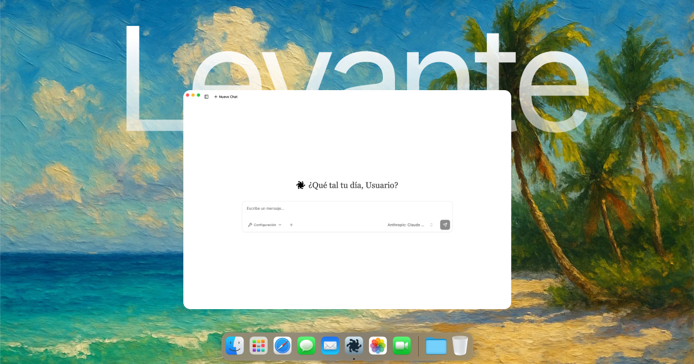

# Levante – Personal, Secure, Free, Local AI

  

  
  
  
  

Levante is a cross-platform desktop app (Windows, macOS, Linux) that brings powerful AI tools closer to everyone — not just technical users. It focuses on **privacy**, **clarity**, and **ease of use**, with first-class support for multiple AI providers and full **Model Context Protocol (MCP)** integration.

---

## Table of Contents

- [Levante – Personal, Secure, Free, Local AI](#levante--personal-secure-free-local-ai)
  - [Table of Contents](#table-of-contents)
  - [Device Compatibility](#device-compatibility)
  - [Key Features](#key-features)
    - [Multi-provider AI](#multi-provider-ai)
    - [Multimodal Chat](#multimodal-chat)
    - [Privacy \& Security](#privacy--security)
    - [Model Context Protocol (MCP)](#model-context-protocol-mcp)
  - [Getting Started](#getting-started)
    - [Installation](#installation)
    - [First-time Setup](#first-time-setup)
    - [Using MCPs](#using-mcps)
  - [Development](#development)
    - [Contributing](#contributing)
    - [Branch Strategy](#branch-strategy)
  - [License](#license)
  - [Contributors](#contributors)
  - [Community](#community)

---

## Device Compatibility

Levante is available for the major desktop platforms:

- **macOS** (Intel & Apple Silicon)
- **Windows** (x64)
- **Linux** (x64)

---

## Key Features

### Multi-provider AI

- **Multi-provider support out of the box:**
  - **OpenRouter** (100+ models with a single API key)
  - **Vercel AI Gateway** (routing, fallbacks, observability)
  - **Local models**: Ollama, LM Studio, and custom HTTP endpoints
  - **Direct cloud providers**: OpenAI, Anthropic, Google, Groq, xAI, Hugging Face, and more
- **Automatic model sync** to keep the model catalog up to date across providers.

---

### Multimodal Chat

Chat with text, images, and (optionally) audio in a unified interface:

- Attach **images** directly into your conversations.
- Route requests automatically to compatible **vision** / **audio** models.
- Automatic **capability detection** to pick the right model features (vision, speech, etc.).

  

---

### Privacy & Security

Levante is built with a **privacy-first** philosophy:

- **Local-only storage** for chats and settings.
- **API keys encrypted** using the system keychain where available.
- **Offline-friendly** when using local models.
- No hidden data collection; you stay in control of what is sent to providers.

---

### Model Context Protocol (MCP)

Levante is a full MCP client, supporting:

- ✅ **Tools**
- ✅ **Prompts**
- ✅ **Resources**

  

On top of basic MCP support, Levante includes:

- **MCP Store & MCP-UI flows**: discover, configure, and manage MCP servers from a friendly UI — one of the few MCP clients that implements this pattern.

  

- **Guided MCP setup**:
  - Automatic config extraction from docs/URLs.
  - Runtime diagnostics and resolution.
  - Designed so **non-technical users** can enable advanced MCP servers quickly.

---

## Getting Started

### Installation

1. Go to **[levanteapp.com](https://www.levanteapp.com/)**.
2. Download the latest release for your OS:
   - macOS (Intel or Apple Silicon)
   - Windows x64
   - Linux x64
3. Install (or unzip) the application for your platform.
4. Launch **Levante**.

---

### First-time Setup

1. On first launch, follow the short **onboarding questionnaire**.
2. Connect Levante to your primary AI provider (by default, **OpenRouter**) by pasting your API key.
3. Optionally add more providers (OpenAI, Anthropic, local models, etc.) from the **Settings / Providers** section.
4. Start chatting — your conversations and configuration are stored locally.

---

### Using MCPs

1. Open the **MCP Store** inside Levante.
2. Browse available MCP servers or add your own via URL/config.
3. Once enabled, MCP tools/resources/prompts become available directly in the chat.

  

---

## Development

### Contributing

We welcome contributions of all kinds: bug reports, feature ideas, documentation improvements, and pull requests.

- Start with **`docs/GETTING_STARTED.md`** to set up your local development environment.
- Read **`CONTRIBUTING.md`** for:
  - Code style and linting rules
  - Commit message conventions
  - How to structure pull requests
  - Issue and PR templates

If you’re unsure where to start, feel free to open a **discussion** or join the **Discord** (see [Community](#community)).

---

### Branch Strategy

We follow a simple, production-oriented Git workflow:

- **`main`**
  - Production-ready releases only.
  - Tagged and versioned builds.
- **`develop`**
  - Default branch for day-to-day development.
  - Integration branch for features and fixes.
- **Feature branches**
  - Create from `develop`: `feature/short-description`
  - Merge back into `develop` via **Pull Request**.
  - Require at least **one approval** before merge.
- **Branch protection**
  - Direct pushes to `main` and `develop` are blocked.
  - All changes flow through pull requests for review.

---

## License

Levante is distributed under a **source-available** license:

- **Base license:** Apache 2.0 with **Commons Clause** (no right to “Sell” the software).
- **Commercial use / embedding / resale:**
  - Requires explicit permission.
  - Contact: **`support@levante.app`**

For the full terms, please refer to:

- `COMMERCIAL-LICENSE.md`
- `docs/LEGAL/LICENSING.md`

---

## Contributors

<table align="center">
  <tr>
    <td align="center">
      
      
<strong>Saúl</strong>

    </td>
    <td align="center">
      
      
<strong>Oliver</strong>

    </td>
    <td align="center">
      
      
<strong>Alejandro</strong>

    </td>
    <td align="center">
      
      
<strong>Dennis</strong>

    </td>
    <td align="center">
      
      
<strong>Mauro</strong>

    </td>
    <td align="center">
      
      
<strong>Javier</strong>

    </td>
  </tr>
</table>

We’re grateful to everyone who has contributed code, ideas, issues, and feedback.

---

## Community

Stay up to date, share feedback, and connect with other users and contributors:

- **Discord:** https://discord.gg/Ane83d2EFG  
- **Website:** https://www.levanteapp.com/

If you’re using Levante in your own workflows or products, we’d love to hear about it — feel free to open a discussion or reach out on Discord.
