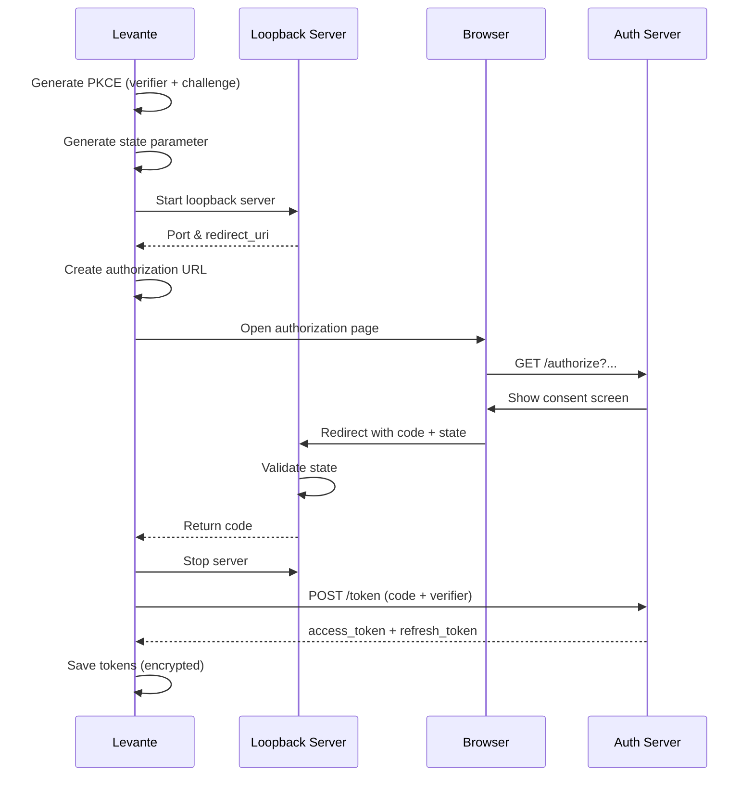

# Fase 2: OAuth Flow con PKCE - Plan de Implementación Detallado

## Información del Documento

- **Fase**: 2 - OAuth Flow con PKCE
- **Fecha**: 2025-12-21
- **Estado**: Listo para implementación
- **Duración estimada**: 2-3 semanas
- **Dependencias**: Fase 1 completada (Token Store Seguro)
- **Autor**: Arquitectura Levante

## Índice

1. [Objetivos de la Fase 2](#objetivos-de-la-fase-2)
2. [Arquitectura y Decisiones](#arquitectura-y-decisiones)
3. [Estructura de Archivos](#estructura-de-archivos)
4. [Plan de Implementación Paso a Paso](#plan-de-implementación-paso-a-paso)
5. [Testing](#testing)
6. [Validación Final](#validación-final)

---

## Objetivos de la Fase 2

### Objetivos Principales

1. ✅ Implementar Authorization Code Flow completo con OAuth 2.1
2. ✅ Generar y validar PKCE (Proof Key for Code Exchange) con S256
3. ✅ Crear Loopback HTTP server para recibir callback de autorización
4. ✅ Intercambiar authorization code por access/refresh tokens
5. ✅ Implementar refresh de tokens automático

### Alcance

**Incluye:**
- OAuthFlowManager con PKCE S256
- OAuthRedirectServer (loopback HTTP)
- Generación segura de state parameter
- Token exchange con validación completa
- Refresh token flow
- Tests unitarios e integración

**No incluye:**
- Discovery automático de authorization servers (Fase 3)
- Integración con HTTP clients de MCP (Fase 4)
- Dynamic Client Registration (Fase 5)
- UI components (Fase 6)

---

## Arquitectura y Decisiones

### Flujo OAuth 2.1 con PKCE



### Decisiones Clave

**1. PKCE S256 (Obligatorio)**
- **Decisión**: Usar SHA-256 para code_challenge
- **Justificación**: OAuth 2.1 requiere PKCE, S256 es más seguro que plain
- **Implementación**: `crypto.createHash('sha256')` con base64url encoding

**2. Loopback Redirect (127.0.0.1)**
- **Decisión**: HTTP server en 127.0.0.1 con puerto aleatorio
- **Justificación**: Más seguro que custom protocol (RFC 8252)
- **Puerto**: Aleatorio para evitar conflictos
- **Path**: `/callback` fijo

**3. State Parameter**
- **Decisión**: 128 bits de entropía, timeout de 5 minutos
- **Justificación**: Prevenir CSRF attacks
- **Storage**: In-memory Map con auto-cleanup

**4. Token Storage**
- **Decisión**: Usar OAuthTokenStore de Fase 1
- **Justificación**: Reutilizar infraestructura segura ya implementada

---

## Estructura de Archivos

### Nuevos Archivos a Crear

```
src/main/services/oauth/
├── OAuthFlowManager.ts               # Authorization Code Flow + PKCE
├── OAuthRedirectServer.ts            # Loopback HTTP server
├── OAuthStateManager.ts              # State parameter management
└── __tests__/
    ├── OAuthFlowManager.test.ts      # Unit tests
    ├── OAuthRedirectServer.test.ts   # Unit tests
    └── oauth-integration.test.ts     # Integration tests
```

### Archivos a Modificar

```
src/main/services/oauth/
├── types.ts                          # Añadir nuevos tipos
└── index.ts                          # Exportar nuevos servicios
```

---

## Plan de Implementación Paso a Paso

### Paso 1: Extender Tipos TypeScript

**Archivo**: `src/main/services/oauth/types.ts`

**Añadir al final del archivo existente:**

```typescript
/**
 * OAuth Flow Types - Fase 2
 */

/**
 * Parámetros PKCE (Proof Key for Code Exchange)
 */
export interface PKCEParams {
  /** Code verifier (43-128 caracteres, base64url) */
  verifier: string;

  /** Code challenge (SHA-256 del verifier, base64url) */
  challenge: string;

  /** Método usado: siempre 'S256' para OAuth 2.1 */
  method: 'S256';
}

/**
 * Parámetros para crear Authorization URL
 */
export interface AuthorizationUrlParams {
  /** Endpoint de autorización del AS */
  authorizationEndpoint: string;

  /** Client ID registrado */
  clientId: string;

  /** Redirect URI (loopback) */
  redirectUri: string;

  /** Scopes a solicitar */
  scopes: string[];

  /** State parameter (anti-CSRF) */
  state: string;

  /** PKCE code challenge */
  codeChallenge: string;

  /** PKCE code challenge method */
  codeChallengeMethod: 'S256';

  /** Resource indicator (RFC 8707) - opcional */
  resource?: string;
}

/**
 * Parámetros para token exchange
 */
export interface TokenExchangeParams {
  /** Token endpoint del AS */
  tokenEndpoint: string;

  /** Authorization code recibido */
  code: string;

  /** Redirect URI usado en authorization */
  redirectUri: string;

  /** Client ID */
  clientId: string;

  /** PKCE code verifier */
  codeVerifier: string;

  /** Client secret (solo confidential clients) */
  clientSecret?: string;
}

/**
 * Parámetros para refresh token
 */
export interface TokenRefreshParams {
  /** Token endpoint del AS */
  tokenEndpoint: string;

  /** Refresh token */
  refreshToken: string;

  /** Client ID */
  clientId: string;

  /** Client secret (solo confidential clients) */
  clientSecret?: string;

  /** Scopes a solicitar (opcional) */
  scopes?: string[];
}

/**
 * Callback recibido del authorization server
 */
export interface AuthorizationCallback {
  /** Authorization code */
  code: string;

  /** State parameter (debe coincidir) */
  state: string;

  /** Error code si authorization falló */
  error?: string;

  /** Error description */
  errorDescription?: string;
}

/**
 * Configuración del loopback server
 */
export interface LoopbackServerConfig {
  /** Puerto a usar (0 = aleatorio) */
  port?: number;

  /** Hostname (siempre 127.0.0.1) */
  hostname?: string;

  /** Path del callback (siempre /callback) */
  callbackPath?: string;

  /** Timeout en ms (default: 5 minutos) */
  timeout?: number;
}

/**
 * Resultado del loopback server
 */
export interface LoopbackServerResult {
  /** Puerto asignado */
  port: number;

  /** URL completa del redirect */
  redirectUri: string;
}

/**
 * State almacenado temporalmente
 */
export interface StoredState {
  /** Server ID asociado */
  serverId: string;

  /** PKCE verifier asociado */
  codeVerifier: string;

  /** Timestamp de expiración */
  expiresAt: number;

  /** Redirect URI usado */
  redirectUri: string;
}

/**
 * Errores relacionados con OAuth Flow
 */
export class OAuthFlowError extends Error {
  constructor(
    message: string,
    public readonly code:
      | 'PKCE_GENERATION_FAILED'
      | 'INVALID_STATE'
      | 'STATE_EXPIRED'
      | 'AUTHORIZATION_DENIED'
      | 'TOKEN_EXCHANGE_FAILED'
      | 'TOKEN_REFRESH_FAILED'
      | 'LOOPBACK_SERVER_FAILED'
      | 'CALLBACK_TIMEOUT'
      | 'INVALID_RESPONSE',
    public readonly details?: any
  ) {
    super(message);
    this.name = 'OAuthFlowError';
  }
}
```

---

### Paso 2: Implementar OAuthStateManager

**Archivo**: `src/main/services/oauth/OAuthStateManager.ts`

```typescript
import * as crypto from 'crypto';
import { getLogger } from '../logging';
import type { StoredState } from './types';
import { OAuthFlowError } from './types';

/**
 * OAuthStateManager
 *
 * Gestiona state parameters para prevenir CSRF attacks en OAuth flow
 * - Genera state parameters aleatorios
 * - Almacena temporalmente con timeout
 * - Valida state en callback
 */
export class OAuthStateManager {
  private logger = getLogger();
  private states = new Map<string, StoredState>();
  private readonly DEFAULT_TIMEOUT = 5 * 60 * 1000; // 5 minutos

  /**
   * Genera un state parameter aleatorio
   * Mínimo 128 bits de entropía (RFC 6749)
   */
  generateState(): string {
    // 16 bytes = 128 bits
    const state = crypto.randomBytes(16).toString('hex');

    this.logger.core.debug('State parameter generated', {
      statePreview: state.substring(0, 8) + '...',
    });

    return state;
  }

  /**
   * Almacena state con información asociada
   */
  storeState(
    state: string,
    serverId: string,
    codeVerifier: string,
    redirectUri: string,
    timeout: number = this.DEFAULT_TIMEOUT
  ): void {
    const expiresAt = Date.now() + timeout;

    this.states.set(state, {
      serverId,
      codeVerifier,
      expiresAt,
      redirectUri,
    });

    this.logger.core.debug('State stored', {
      serverId,
      statePreview: state.substring(0, 8) + '...',
      expiresAt: new Date(expiresAt).toISOString(),
    });

    // Auto-cleanup después del timeout
    setTimeout(() => {
      this.deleteState(state);
    }, timeout);
  }

  /**
   * Valida y recupera state
   * Lanza error si state es inválido o expirado
   */
  validateAndRetrieveState(state: string): StoredState {
    const stored = this.states.get(state);

    if (!stored) {
      this.logger.core.warn('Invalid state parameter', {
        statePreview: state.substring(0, 8) + '...',
      });
      throw new OAuthFlowError(
        'Invalid state parameter - not found',
        'INVALID_STATE'
      );
    }

    // Verificar expiración
    if (Date.now() >= stored.expiresAt) {
      this.logger.core.warn('Expired state parameter', {
        serverId: stored.serverId,
        expiredAt: new Date(stored.expiresAt).toISOString(),
      });

      this.deleteState(state);

      throw new OAuthFlowError(
        'State parameter expired',
        'STATE_EXPIRED',
        { expiresAt: stored.expiresAt }
      );
    }

    this.logger.core.debug('State validated successfully', {
      serverId: stored.serverId,
    });

    // Eliminar state después de uso (one-time use)
    this.deleteState(state);

    return stored;
  }

  /**
   * Elimina un state
   */
  deleteState(state: string): void {
    const existed = this.states.delete(state);

    if (existed) {
      this.logger.core.debug('State deleted', {
        statePreview: state.substring(0, 8) + '...',
      });
    }
  }

  /**
   * Limpia todos los states expirados
   * Útil para mantenimiento
   */
  cleanExpiredStates(): number {
    const now = Date.now();
    let cleanedCount = 0;

    for (const [state, stored] of this.states.entries()) {
      if (now >= stored.expiresAt) {
        this.states.delete(state);
        cleanedCount++;
      }
    }

    if (cleanedCount > 0) {
      this.logger.core.info('Expired states cleaned', { count: cleanedCount });
    }

    return cleanedCount;
  }

  /**
   * Obtiene el número de states activos
   */
  getActiveStatesCount(): number {
    return this.states.size;
  }

  /**
   * Limpia todos los states (útil para testing)
   */
  clearAll(): void {
    const count = this.states.size;
    this.states.clear();
    this.logger.core.debug('All states cleared', { count });
  }
}
```

---

### Paso 3: Implementar OAuthRedirectServer

**Archivo**: `src/main/services/oauth/OAuthRedirectServer.ts`

```typescript
import * as http from 'http';
import * as net from 'net';
import { getLogger } from '../logging';
import type {
  LoopbackServerConfig,
  LoopbackServerResult,
  AuthorizationCallback,
} from './types';
import { OAuthFlowError } from './types';

/**
 * OAuthRedirectServer
 *
 * Servidor HTTP loopback (127.0.0.1) para recibir callback de OAuth
 * - Puerto aleatorio para evitar conflictos
 * - Timeout configurable (default: 5 minutos)
 * - Respuesta HTML amigable al usuario
 */
export class OAuthRedirectServer {
  private logger = getLogger();
  private server?: http.Server;
  private port?: number;
  private callbackPromise?: Promise<AuthorizationCallback>;
  private resolveCallback?: (value: AuthorizationCallback) => void;
  private rejectCallback?: (error: Error) => void;
  private timeoutHandle?: NodeJS.Timeout;

  private readonly DEFAULT_CONFIG: Required<LoopbackServerConfig> = {
    port: 0, // 0 = random port
    hostname: '127.0.0.1',
    callbackPath: '/callback',
    timeout: 5 * 60 * 1000, // 5 minutos
  };

  /**
   * Inicia el servidor loopback
   * Retorna el puerto y redirect_uri
   */
  async start(
    config: LoopbackServerConfig = {}
  ): Promise<LoopbackServerResult> {
    const finalConfig = { ...this.DEFAULT_CONFIG, ...config };

    try {
      // Encontrar puerto disponible
      this.port = await this.findAvailablePort(finalConfig.port);

      this.logger.core.info('Starting OAuth redirect server', {
        port: this.port,
        hostname: finalConfig.hostname,
      });

      // Crear promise para callback
      this.callbackPromise = new Promise<AuthorizationCallback>(
        (resolve, reject) => {
          this.resolveCallback = resolve;
          this.rejectCallback = reject;

          // Timeout
          this.timeoutHandle = setTimeout(() => {
            reject(
              new OAuthFlowError(
                'OAuth callback timeout - user did not complete authorization',
                'CALLBACK_TIMEOUT',
                { timeout: finalConfig.timeout }
              )
            );
            this.stop();
          }, finalConfig.timeout);
        }
      );

      // Crear servidor HTTP
      this.server = http.createServer((req, res) => {
        this.handleRequest(req, res, finalConfig.callbackPath);
      });

      // Iniciar servidor
      await new Promise<void>((resolve, reject) => {
        this.server!.listen(this.port, finalConfig.hostname, () => {
          this.logger.core.debug('OAuth redirect server listening', {
            port: this.port,
          });
          resolve();
        });

        this.server!.on('error', (error) => {
          this.logger.core.error('OAuth redirect server error', {
            error: error.message,
          });
          reject(
            new OAuthFlowError(
              'Failed to start loopback server',
              'LOOPBACK_SERVER_FAILED',
              { error: error.message }
            )
          );
        });
      });

      const redirectUri = `http://${finalConfig.hostname}:${this.port}${finalConfig.callbackPath}`;

      return {
        port: this.port,
        redirectUri,
      };
    } catch (error) {
      this.logger.core.error('Failed to start OAuth redirect server', {
        error: error instanceof Error ? error.message : error,
      });
      throw error;
    }
  }

  /**
   * Espera por el callback de OAuth
   */
  async waitForCallback(): Promise<AuthorizationCallback> {
    if (!this.callbackPromise) {
      throw new OAuthFlowError(
        'Server not started',
        'LOOPBACK_SERVER_FAILED'
      );
    }

    try {
      const result = await this.callbackPromise;
      return result;
    } finally {
      // Cleanup timeout
      if (this.timeoutHandle) {
        clearTimeout(this.timeoutHandle);
      }
    }
  }

  /**
   * Detiene el servidor
   */
  async stop(): Promise<void> {
    if (this.server) {
      this.logger.core.info('Stopping OAuth redirect server');

      await new Promise<void>((resolve) => {
        this.server!.close(() => {
          this.logger.core.debug('OAuth redirect server stopped');
          resolve();
        });
      });

      this.server = undefined;
      this.port = undefined;
    }

    if (this.timeoutHandle) {
      clearTimeout(this.timeoutHandle);
      this.timeoutHandle = undefined;
    }
  }

  /**
   * Encuentra un puerto disponible
   */
  private async findAvailablePort(preferredPort: number = 0): Promise<number> {
    return new Promise((resolve, reject) => {
      const server = net.createServer();

      server.listen(preferredPort, '127.0.0.1', () => {
        const address = server.address() as net.AddressInfo;
        const port = address.port;

        server.close(() => {
          this.logger.core.debug('Found available port', { port });
          resolve(port);
        });
      });

      server.on('error', (error) => {
        this.logger.core.error('Failed to find available port', {
          error: error.message,
        });
        reject(error);
      });
    });
  }

  /**
   * Maneja request HTTP del callback
   */
  private handleRequest(
    req: http.IncomingMessage,
    res: http.ServerResponse,
    expectedPath: string
  ): void {
    try {
      const url = new URL(req.url!, `http://127.0.0.1:${this.port}`);

      // Validar path
      if (url.pathname !== expectedPath) {
        this.logger.core.warn('Invalid callback path', {
          expected: expectedPath,
          received: url.pathname,
        });

        res.writeHead(404, { 'Content-Type': 'text/html; charset=utf-8' });
        res.end(this.createErrorPage('Invalid callback path'));
        return;
      }

      // Extraer parámetros
      const code = url.searchParams.get('code');
      const state = url.searchParams.get('state');
      const error = url.searchParams.get('error');
      const errorDescription = url.searchParams.get('error_description');

      this.logger.core.debug('OAuth callback received', {
        hasCode: !!code,
        hasState: !!state,
        hasError: !!error,
      });

      // Check for error response
      if (error) {
        this.logger.core.warn('OAuth authorization denied', {
          error,
          errorDescription,
        });

        res.writeHead(200, { 'Content-Type': 'text/html; charset=utf-8' });
        res.end(
          this.createErrorPage(
            errorDescription || error,
            'Authorization Failed'
          )
        );

        this.rejectCallback?.(
          new OAuthFlowError(
            `Authorization denied: ${errorDescription || error}`,
            'AUTHORIZATION_DENIED',
            { error, errorDescription }
          )
        );
        return;
      }

      // Validar parámetros requeridos
      if (!code || !state) {
        this.logger.core.error('Missing required callback parameters', {
          hasCode: !!code,
          hasState: !!state,
        });

        res.writeHead(400, { 'Content-Type': 'text/html; charset=utf-8' });
        res.end(this.createErrorPage('Missing required parameters'));

        this.rejectCallback?.(
          new OAuthFlowError(
            'Missing code or state parameter in callback',
            'INVALID_RESPONSE'
          )
        );
        return;
      }

      // Success
      res.writeHead(200, { 'Content-Type': 'text/html; charset=utf-8' });
      res.end(this.createSuccessPage());

      this.resolveCallback?.({
        code,
        state,
      });
    } catch (error) {
      this.logger.core.error('Error handling OAuth callback', {
        error: error instanceof Error ? error.message : error,
      });

      res.writeHead(500, { 'Content-Type': 'text/html; charset=utf-8' });
      res.end(this.createErrorPage('Internal server error'));

      this.rejectCallback?.(
        new OAuthFlowError(
          'Failed to process OAuth callback',
          'LOOPBACK_SERVER_FAILED',
          { error }
        )
      );
    }
  }

  /**
   * Genera página HTML de éxito
   */
  private createSuccessPage(): string {
    return `
<!DOCTYPE html>
<html lang="en">
<head>
  <meta charset="UTF-8">
  <meta name="viewport" content="width=device-width, initial-scale=1.0">
  <title>Authorization Successful - Levante</title>
  <style>
    body {
      font-family: -apple-system, BlinkMacSystemFont, 'Segoe UI', Roboto, sans-serif;
      display: flex;
      align-items: center;
      justify-content: center;
      min-height: 100vh;
      margin: 0;
      background: linear-gradient(135deg, #667eea 0%, #764ba2 100%);
    }
    .container {
      background: white;
      border-radius: 12px;
      padding: 48px;
      text-align: center;
      box-shadow: 0 20px 60px rgba(0, 0, 0, 0.3);
      max-width: 400px;
    }
    .icon {
      width: 64px;
      height: 64px;
      margin: 0 auto 24px;
      background: #10b981;
      border-radius: 50%;
      display: flex;
      align-items: center;
      justify-content: center;
    }
    .checkmark {
      color: white;
      font-size: 32px;
    }
    h1 {
      color: #1f2937;
      font-size: 24px;
      margin: 0 0 16px;
    }
    p {
      color: #6b7280;
      font-size: 16px;
      line-height: 1.5;
      margin: 0;
    }
  </style>
</head>
<body>
  <div class="container">
    <div class="icon">
      <span class="checkmark">✓</span>
    </div>
    <h1>Authorization Successful!</h1>
    <p>You can now close this window and return to Levante.</p>
  </div>
</body>
</html>
    `.trim();
  }

  /**
   * Genera página HTML de error
   */
  private createErrorPage(
    message: string,
    title: string = 'Authorization Error'
  ): string {
    return `
<!DOCTYPE html>
<html lang="en">
<head>
  <meta charset="UTF-8">
  <meta name="viewport" content="width=device-width, initial-scale=1.0">
  <title>${title} - Levante</title>
  <style>
    body {
      font-family: -apple-system, BlinkMacSystemFont, 'Segoe UI', Roboto, sans-serif;
      display: flex;
      align-items: center;
      justify-content: center;
      min-height: 100vh;
      margin: 0;
      background: linear-gradient(135deg, #f87171 0%, #dc2626 100%);
    }
    .container {
      background: white;
      border-radius: 12px;
      padding: 48px;
      text-align: center;
      box-shadow: 0 20px 60px rgba(0, 0, 0, 0.3);
      max-width: 400px;
    }
    .icon {
      width: 64px;
      height: 64px;
      margin: 0 auto 24px;
      background: #ef4444;
      border-radius: 50%;
      display: flex;
      align-items: center;
      justify-content: center;
    }
    .cross {
      color: white;
      font-size: 32px;
    }
    h1 {
      color: #1f2937;
      font-size: 24px;
      margin: 0 0 16px;
    }
    p {
      color: #6b7280;
      font-size: 16px;
      line-height: 1.5;
      margin: 0;
    }
  </style>
</head>
<body>
  <div class="container">
    <div class="icon">
      <span class="cross">✕</span>
    </div>
    <h1>${title}</h1>
    <p>${message}</p>
    <p style="margin-top: 16px; font-size: 14px;">You can close this window.</p>
  </div>
</body>
</html>
    `.trim();
  }
}
```

---

### Paso 4: Implementar OAuthFlowManager

**Archivo**: `src/main/services/oauth/OAuthFlowManager.ts`

```typescript
import * as crypto from 'crypto';
import { shell } from 'electron';
import { getLogger } from '../logging';
import { OAuthRedirectServer } from './OAuthRedirectServer';
import { OAuthStateManager } from './OAuthStateManager';
import type {
  PKCEParams,
  AuthorizationUrlParams,
  TokenExchangeParams,
  TokenRefreshParams,
  OAuthTokens,
} from './types';
import { OAuthFlowError } from './types';

/**
 * OAuthFlowManager
 *
 * Gestiona el flujo completo de OAuth 2.1 con PKCE
 * - Generación de PKCE (S256)
 * - Creación de Authorization URLs
 * - Intercambio de code por tokens
 * - Refresh de tokens
 */
export class OAuthFlowManager {
  private logger = getLogger();
  private redirectServer: OAuthRedirectServer;
  private stateManager: OAuthStateManager;

  constructor() {
    this.redirectServer = new OAuthRedirectServer();
    this.stateManager = new OAuthStateManager();
  }

  /**
   * Genera parámetros PKCE (S256)
   * RFC 7636 - Proof Key for Code Exchange
   */
  generatePKCE(): PKCEParams {
    try {
      // Generar code_verifier (43-128 caracteres)
      // 32 bytes = 43 caracteres en base64url
      const verifier = crypto.randomBytes(32).toString('base64url');

      // Generar code_challenge = BASE64URL(SHA256(verifier))
      const challenge = crypto
        .createHash('sha256')
        .update(verifier)
        .digest('base64url');

      this.logger.core.debug('PKCE generated', {
        verifierLength: verifier.length,
        challengeLength: challenge.length,
      });

      return {
        verifier,
        challenge,
        method: 'S256',
      };
    } catch (error) {
      this.logger.core.error('Failed to generate PKCE', {
        error: error instanceof Error ? error.message : error,
      });
      throw new OAuthFlowError(
        'Failed to generate PKCE parameters',
        'PKCE_GENERATION_FAILED',
        { error }
      );
    }
  }

  /**
   * Crea Authorization URL para iniciar OAuth flow
   */
  createAuthorizationUrl(params: AuthorizationUrlParams): string {
    try {
      const url = new URL(params.authorizationEndpoint);

      // Parámetros OAuth 2.1
      url.searchParams.set('response_type', 'code');
      url.searchParams.set('client_id', params.clientId);
      url.searchParams.set('redirect_uri', params.redirectUri);
      url.searchParams.set('scope', params.scopes.join(' '));
      url.searchParams.set('state', params.state);
      url.searchParams.set('code_challenge', params.codeChallenge);
      url.searchParams.set('code_challenge_method', params.codeChallengeMethod);

      // RFC 8707: Resource Indicators (opcional)
      if (params.resource) {
        url.searchParams.set('resource', params.resource);
      }

      this.logger.core.debug('Authorization URL created', {
        endpoint: params.authorizationEndpoint,
        clientId: params.clientId,
        scopes: params.scopes,
      });

      return url.toString();
    } catch (error) {
      this.logger.core.error('Failed to create authorization URL', {
        error: error instanceof Error ? error.message : error,
      });
      throw new OAuthFlowError(
        'Failed to create authorization URL',
        'INVALID_RESPONSE',
        { error }
      );
    }
  }

  /**
   * Ejecuta el flujo completo de autorización
   * 1. Genera PKCE
   * 2. Inicia loopback server
   * 3. Abre browser
   * 4. Espera callback
   * 5. Valida state
   * 6. Retorna code y verifier para exchange
   */
  async authorize(params: {
    serverId: string;
    authorizationEndpoint: string;
    clientId: string;
    scopes: string[];
    resource?: string;
  }): Promise<{ code: string; verifier: string }> {
    try {
      this.logger.core.info('Starting OAuth authorization flow', {
        serverId: params.serverId,
        authorizationEndpoint: params.authorizationEndpoint,
      });

      // 1. Generar PKCE
      const pkce = this.generatePKCE();

      // 2. Generar state
      const state = this.stateManager.generateState();

      // 3. Iniciar loopback server
      const { redirectUri } = await this.redirectServer.start();

      // 4. Almacenar state
      this.stateManager.storeState(
        state,
        params.serverId,
        pkce.verifier,
        redirectUri
      );

      // 5. Crear authorization URL
      const authUrl = this.createAuthorizationUrl({
        authorizationEndpoint: params.authorizationEndpoint,
        clientId: params.clientId,
        redirectUri,
        scopes: params.scopes,
        state,
        codeChallenge: pkce.challenge,
        codeChallengeMethod: 'S256',
        resource: params.resource,
      });

      this.logger.core.info('Opening browser for authorization', {
        serverId: params.serverId,
      });

      // 6. Abrir browser
      await shell.openExternal(authUrl);

      // 7. Esperar callback
      const callback = await this.redirectServer.waitForCallback();

      // 8. Detener server
      await this.redirectServer.stop();

      // 9. Validar state
      const storedState = this.stateManager.validateAndRetrieveState(
        callback.state
      );

      this.logger.core.info('Authorization successful', {
        serverId: storedState.serverId,
      });

      return {
        code: callback.code,
        verifier: storedState.codeVerifier,
      };
    } catch (error) {
      // Cleanup
      await this.redirectServer.stop();

      this.logger.core.error('Authorization flow failed', {
        serverId: params.serverId,
        error: error instanceof Error ? error.message : error,
      });

      throw error;
    }
  }

  /**
   * Intercambia authorization code por tokens
   */
  async exchangeCodeForTokens(
    params: TokenExchangeParams
  ): Promise<OAuthTokens> {
    try {
      this.logger.core.info('Exchanging code for tokens', {
        tokenEndpoint: params.tokenEndpoint,
      });

      // Construir body
      const body = new URLSearchParams({
        grant_type: 'authorization_code',
        code: params.code,
        redirect_uri: params.redirectUri,
        client_id: params.clientId,
        code_verifier: params.codeVerifier,
      });

      // Client secret (solo confidential clients)
      if (params.clientSecret) {
        body.set('client_secret', params.clientSecret);
      }

      // Hacer request
      const response = await fetch(params.tokenEndpoint, {
        method: 'POST',
        headers: {
          'Content-Type': 'application/x-www-form-urlencoded',
          Accept: 'application/json',
        },
        body: body.toString(),
      });

      // Parse response
      const data = await response.json();

      if (!response.ok) {
        this.logger.core.error('Token exchange failed', {
          status: response.status,
          error: data.error,
          errorDescription: data.error_description,
        });

        throw new OAuthFlowError(
          `Token exchange failed: ${data.error_description || data.error}`,
          'TOKEN_EXCHANGE_FAILED',
          {
            status: response.status,
            error: data.error,
            errorDescription: data.error_description,
          }
        );
      }

      // Validar respuesta
      if (!data.access_token) {
        throw new OAuthFlowError(
          'Token response missing access_token',
          'INVALID_RESPONSE',
          { response: data }
        );
      }

      // Calcular expiración
      const expiresIn = data.expires_in || 3600; // Default 1 hora
      const expiresAt = Date.now() + expiresIn * 1000;

      this.logger.core.info('Tokens received successfully', {
        hasRefreshToken: !!data.refresh_token,
        expiresIn,
        tokenType: data.token_type,
      });

      return {
        accessToken: data.access_token,
        refreshToken: data.refresh_token,
        expiresAt,
        tokenType: data.token_type || 'Bearer',
        scope: data.scope,
      };
    } catch (error) {
      if (error instanceof OAuthFlowError) {
        throw error;
      }

      this.logger.core.error('Token exchange error', {
        error: error instanceof Error ? error.message : error,
      });

      throw new OAuthFlowError(
        'Failed to exchange code for tokens',
        'TOKEN_EXCHANGE_FAILED',
        { error }
      );
    }
  }

  /**
   * Refresca access token usando refresh token
   */
  async refreshAccessToken(params: TokenRefreshParams): Promise<OAuthTokens> {
    try {
      this.logger.core.info('Refreshing access token', {
        tokenEndpoint: params.tokenEndpoint,
      });

      // Construir body
      const body = new URLSearchParams({
        grant_type: 'refresh_token',
        refresh_token: params.refreshToken,
        client_id: params.clientId,
      });

      // Client secret (solo confidential clients)
      if (params.clientSecret) {
        body.set('client_secret', params.clientSecret);
      }

      // Scopes (opcional)
      if (params.scopes && params.scopes.length > 0) {
        body.set('scope', params.scopes.join(' '));
      }

      // Hacer request
      const response = await fetch(params.tokenEndpoint, {
        method: 'POST',
        headers: {
          'Content-Type': 'application/x-www-form-urlencoded',
          Accept: 'application/json',
        },
        body: body.toString(),
      });

      // Parse response
      const data = await response.json();

      if (!response.ok) {
        this.logger.core.error('Token refresh failed', {
          status: response.status,
          error: data.error,
          errorDescription: data.error_description,
        });

        throw new OAuthFlowError(
          `Token refresh failed: ${data.error_description || data.error}`,
          'TOKEN_REFRESH_FAILED',
          {
            status: response.status,
            error: data.error,
            errorDescription: data.error_description,
          }
        );
      }

      // Validar respuesta
      if (!data.access_token) {
        throw new OAuthFlowError(
          'Token response missing access_token',
          'INVALID_RESPONSE',
          { response: data }
        );
      }

      // Calcular expiración
      const expiresIn = data.expires_in || 3600;
      const expiresAt = Date.now() + expiresIn * 1000;

      this.logger.core.info('Token refreshed successfully', {
        hasNewRefreshToken: !!data.refresh_token,
        expiresIn,
      });

      return {
        accessToken: data.access_token,
        refreshToken: data.refresh_token || params.refreshToken, // Usar el anterior si no hay nuevo
        expiresAt,
        tokenType: data.token_type || 'Bearer',
        scope: data.scope,
      };
    } catch (error) {
      if (error instanceof OAuthFlowError) {
        throw error;
      }

      this.logger.core.error('Token refresh error', {
        error: error instanceof Error ? error.message : error,
      });

      throw new OAuthFlowError(
        'Failed to refresh access token',
        'TOKEN_REFRESH_FAILED',
        { error }
      );
    }
  }

  /**
   * Cleanup: limpia states expirados
   */
  cleanup(): void {
    this.stateManager.cleanExpiredStates();
  }
}
```

---

### Paso 5: Actualizar Index para Exports

**Archivo**: `src/main/services/oauth/index.ts`

**Modificar para añadir nuevos exports:**

```typescript
/**
 * OAuth Services
 *
 * Fase 1: Token Store Seguro
 * Fase 2: OAuth Flow con PKCE
 */

// Fase 1
export { OAuthTokenStore } from './OAuthTokenStore';

// Fase 2
export { OAuthFlowManager } from './OAuthFlowManager';
export { OAuthRedirectServer } from './OAuthRedirectServer';
export { OAuthStateManager } from './OAuthStateManager';

// Types
export type {
  OAuthTokens,
  StoredOAuthTokens,
  OAuthConfig,
  MCPServerConfigWithOAuth,
  UIPreferencesWithOAuth,
  PKCEParams,
  AuthorizationUrlParams,
  TokenExchangeParams,
  TokenRefreshParams,
  AuthorizationCallback,
  LoopbackServerConfig,
  LoopbackServerResult,
  StoredState,
} from './types';

export { OAuthTokenStoreError, OAuthFlowError } from './types';
```

---

## Testing

### Paso 6: Tests Unitarios - OAuthFlowManager

**Archivo**: `src/main/services/oauth/__tests__/OAuthFlowManager.test.ts`

```typescript
import { describe, it, expect, beforeEach, vi, afterEach } from 'vitest';
import { OAuthFlowManager } from '../OAuthFlowManager';
import type { OAuthTokens } from '../types';

// Mock electron
vi.mock('electron', () => ({
  shell: {
    openExternal: vi.fn(),
  },
}));

// Mock logger
vi.mock('../../logging', () => ({
  getLogger: () => ({
    core: {
      info: vi.fn(),
      debug: vi.fn(),
      warn: vi.fn(),
      error: vi.fn(),
    },
  }),
}));

describe('OAuthFlowManager', () => {
  let flowManager: OAuthFlowManager;

  beforeEach(() => {
    flowManager = new OAuthFlowManager();
  });

  describe('generatePKCE', () => {
    it('should generate PKCE with S256', () => {
      const pkce = flowManager.generatePKCE();

      expect(pkce.verifier).toBeDefined();
      expect(pkce.challenge).toBeDefined();
      expect(pkce.method).toBe('S256');

      // Verificar longitud del verifier (43-128 caracteres)
      expect(pkce.verifier.length).toBeGreaterThanOrEqual(43);
      expect(pkce.verifier.length).toBeLessThanOrEqual(128);

      // Verificar que challenge es diferente de verifier
      expect(pkce.challenge).not.toBe(pkce.verifier);
    });

    it('should generate unique PKCE on each call', () => {
      const pkce1 = flowManager.generatePKCE();
      const pkce2 = flowManager.generatePKCE();

      expect(pkce1.verifier).not.toBe(pkce2.verifier);
      expect(pkce1.challenge).not.toBe(pkce2.challenge);
    });

    it('should generate valid base64url strings', () => {
      const pkce = flowManager.generatePKCE();

      // base64url no debe contener +, /, =
      expect(pkce.verifier).not.toMatch(/[+/=]/);
      expect(pkce.challenge).not.toMatch(/[+/=]/);
    });
  });

  describe('createAuthorizationUrl', () => {
    it('should create valid authorization URL', () => {
      const pkce = flowManager.generatePKCE();
      const url = flowManager.createAuthorizationUrl({
        authorizationEndpoint: 'https://auth.example.com/authorize',
        clientId: 'test-client-123',
        redirectUri: 'http://127.0.0.1:8080/callback',
        scopes: ['mcp:read', 'mcp:write'],
        state: 'random-state-abc',
        codeChallenge: pkce.challenge,
        codeChallengeMethod: 'S256',
      });

      const parsed = new URL(url);

      expect(parsed.origin).toBe('https://auth.example.com');
      expect(parsed.pathname).toBe('/authorize');
      expect(parsed.searchParams.get('response_type')).toBe('code');
      expect(parsed.searchParams.get('client_id')).toBe('test-client-123');
      expect(parsed.searchParams.get('redirect_uri')).toBe(
        'http://127.0.0.1:8080/callback'
      );
      expect(parsed.searchParams.get('scope')).toBe('mcp:read mcp:write');
      expect(parsed.searchParams.get('state')).toBe('random-state-abc');
      expect(parsed.searchParams.get('code_challenge')).toBe(pkce.challenge);
      expect(parsed.searchParams.get('code_challenge_method')).toBe('S256');
    });

    it('should include resource parameter when provided', () => {
      const pkce = flowManager.generatePKCE();
      const url = flowManager.createAuthorizationUrl({
        authorizationEndpoint: 'https://auth.example.com/authorize',
        clientId: 'test-client',
        redirectUri: 'http://127.0.0.1:8080/callback',
        scopes: ['mcp:read'],
        state: 'state',
        codeChallenge: pkce.challenge,
        codeChallengeMethod: 'S256',
        resource: 'https://mcp.example.com',
      });

      const parsed = new URL(url);
      expect(parsed.searchParams.get('resource')).toBe(
        'https://mcp.example.com'
      );
    });
  });

  describe('exchangeCodeForTokens', () => {
    it('should exchange code for tokens successfully', async () => {
      // Mock fetch
      const mockTokens = {
        access_token: 'test-access-token',
        refresh_token: 'test-refresh-token',
        expires_in: 3600,
        token_type: 'Bearer',
        scope: 'mcp:read mcp:write',
      };

      global.fetch = vi.fn().mockResolvedValue({
        ok: true,
        json: async () => mockTokens,
      });

      const tokens = await flowManager.exchangeCodeForTokens({
        tokenEndpoint: 'https://auth.example.com/token',
        code: 'auth-code-123',
        redirectUri: 'http://127.0.0.1:8080/callback',
        clientId: 'test-client',
        codeVerifier: 'test-verifier',
      });

      expect(tokens.accessToken).toBe('test-access-token');
      expect(tokens.refreshToken).toBe('test-refresh-token');
      expect(tokens.tokenType).toBe('Bearer');
      expect(tokens.scope).toBe('mcp:read mcp:write');
      expect(tokens.expiresAt).toBeGreaterThan(Date.now());
    });

    it('should throw error on failed token exchange', async () => {
      global.fetch = vi.fn().mockResolvedValue({
        ok: false,
        status: 400,
        json: async () => ({
          error: 'invalid_grant',
          error_description: 'Invalid authorization code',
        }),
      });

      await expect(
        flowManager.exchangeCodeForTokens({
          tokenEndpoint: 'https://auth.example.com/token',
          code: 'invalid-code',
          redirectUri: 'http://127.0.0.1:8080/callback',
          clientId: 'test-client',
          codeVerifier: 'test-verifier',
        })
      ).rejects.toThrow('Token exchange failed');
    });

    it('should include client_secret for confidential clients', async () => {
      global.fetch = vi.fn().mockResolvedValue({
        ok: true,
        json: async () => ({
          access_token: 'token',
          expires_in: 3600,
          token_type: 'Bearer',
        }),
      });

      await flowManager.exchangeCodeForTokens({
        tokenEndpoint: 'https://auth.example.com/token',
        code: 'code',
        redirectUri: 'http://127.0.0.1:8080/callback',
        clientId: 'client',
        codeVerifier: 'verifier',
        clientSecret: 'secret',
      });

      const fetchCall = vi.mocked(global.fetch).mock.calls[0];
      const body = fetchCall[1]?.body as string;

      expect(body).toContain('client_secret=secret');
    });
  });

  describe('refreshAccessToken', () => {
    it('should refresh tokens successfully', async () => {
      const mockTokens = {
        access_token: 'new-access-token',
        refresh_token: 'new-refresh-token',
        expires_in: 3600,
        token_type: 'Bearer',
      };

      global.fetch = vi.fn().mockResolvedValue({
        ok: true,
        json: async () => mockTokens,
      });

      const tokens = await flowManager.refreshAccessToken({
        tokenEndpoint: 'https://auth.example.com/token',
        refreshToken: 'old-refresh-token',
        clientId: 'test-client',
      });

      expect(tokens.accessToken).toBe('new-access-token');
      expect(tokens.refreshToken).toBe('new-refresh-token');
      expect(tokens.expiresAt).toBeGreaterThan(Date.now());
    });

    it('should reuse old refresh token if not rotated', async () => {
      global.fetch = vi.fn().mockResolvedValue({
        ok: true,
        json: async () => ({
          access_token: 'new-access-token',
          expires_in: 3600,
          token_type: 'Bearer',
          // No refresh_token en respuesta
        }),
      });

      const tokens = await flowManager.refreshAccessToken({
        tokenEndpoint: 'https://auth.example.com/token',
        refreshToken: 'old-refresh-token',
        clientId: 'test-client',
      });

      expect(tokens.refreshToken).toBe('old-refresh-token');
    });

    it('should throw error on failed refresh', async () => {
      global.fetch = vi.fn().mockResolvedValue({
        ok: false,
        status: 400,
        json: async () => ({
          error: 'invalid_grant',
          error_description: 'Refresh token expired',
        }),
      });

      await expect(
        flowManager.refreshAccessToken({
          tokenEndpoint: 'https://auth.example.com/token',
          refreshToken: 'expired-token',
          clientId: 'test-client',
        })
      ).rejects.toThrow('Token refresh failed');
    });
  });
});
```

---

### Paso 7: Tests Unitarios - OAuthRedirectServer

**Archivo**: `src/main/services/oauth/__tests__/OAuthRedirectServer.test.ts`

```typescript
import { describe, it, expect, beforeEach, vi, afterEach } from 'vitest';
import { OAuthRedirectServer } from '../OAuthRedirectServer';
import { OAuthFlowError } from '../types';

// Mock logger
vi.mock('../../logging', () => ({
  getLogger: () => ({
    core: {
      info: vi.fn(),
      debug: vi.fn(),
      warn: vi.fn(),
      error: vi.fn(),
    },
  }),
}));

describe('OAuthRedirectServer', () => {
  let redirectServer: OAuthRedirectServer;

  beforeEach(() => {
    redirectServer = new OAuthRedirectServer();
  });

  afterEach(async () => {
    await redirectServer.stop();
  });

  describe('start', () => {
    it('should start server on random port', async () => {
      const result = await redirectServer.start();

      expect(result.port).toBeGreaterThan(0);
      expect(result.redirectUri).toMatch(/^http:\/\/127\.0\.0\.1:\d+\/callback$/);
    });

    it('should start server on preferred port if available', async () => {
      const result = await redirectServer.start({ port: 0 });

      expect(result.port).toBeGreaterThan(0);
      expect(result.redirectUri).toContain('127.0.0.1');
    });

    it('should use default config values', async () => {
      const result = await redirectServer.start();

      expect(result.redirectUri).toContain('127.0.0.1');
      expect(result.redirectUri).toContain('/callback');
    });
  });

  describe('waitForCallback', () => {
    it('should throw if server not started', async () => {
      await expect(redirectServer.waitForCallback()).rejects.toThrow(
        'Server not started'
      );
    });

    it('should timeout after configured duration', async () => {
      await redirectServer.start({ timeout: 100 });

      await expect(redirectServer.waitForCallback()).rejects.toThrow(
        'OAuth callback timeout'
      );
    }, 200);

    it('should resolve when callback received', async () => {
      const { port } = await redirectServer.start();

      // Simular callback en background
      setTimeout(async () => {
        await fetch(
          `http://127.0.0.1:${port}/callback?code=test-code&state=test-state`
        );
      }, 50);

      const callback = await redirectServer.waitForCallback();

      expect(callback.code).toBe('test-code');
      expect(callback.state).toBe('test-state');
    });

    it('should handle error callback', async () => {
      const { port } = await redirectServer.start();

      setTimeout(async () => {
        await fetch(
          `http://127.0.0.1:${port}/callback?error=access_denied&error_description=User%20denied`
        );
      }, 50);

      await expect(redirectServer.waitForCallback()).rejects.toThrow(
        'Authorization denied'
      );
    });
  });

  describe('stop', () => {
    it('should stop server gracefully', async () => {
      await redirectServer.start();
      await redirectServer.stop();

      // Verificar que no hay error al detener de nuevo
      await expect(redirectServer.stop()).resolves.not.toThrow();
    });

    it('should not throw if stopping without starting', async () => {
      await expect(redirectServer.stop()).resolves.not.toThrow();
    });
  });

  describe('callback handling', () => {
    it('should reject invalid callback path', async () => {
      const { port } = await redirectServer.start();

      const response = await fetch(`http://127.0.0.1:${port}/invalid-path`);

      expect(response.status).toBe(404);
    });

    it('should reject callback without required parameters', async () => {
      const { port } = await redirectServer.start();

      setTimeout(async () => {
        await fetch(`http://127.0.0.1:${port}/callback`); // Sin code ni state
      }, 50);

      await expect(redirectServer.waitForCallback()).rejects.toThrow(
        'Missing code or state'
      );
    });

    it('should return success HTML page', async () => {
      const { port } = await redirectServer.start();

      const response = await fetch(
        `http://127.0.0.1:${port}/callback?code=test&state=test`
      );

      const html = await response.text();

      expect(response.status).toBe(200);
      expect(html).toContain('Authorization Successful');
      expect(html).toContain('You can now close this window');
    });

    it('should return error HTML page on error', async () => {
      const { port } = await redirectServer.start();

      const response = await fetch(
        `http://127.0.0.1:${port}/callback?error=access_denied&error_description=User%20denied`
      );

      const html = await response.text();

      expect(response.status).toBe(200);
      expect(html).toContain('Authorization Error');
      expect(html).toContain('User denied');
    });
  });
});
```

---

### Paso 8: Tests de Integración

**Archivo**: `src/main/services/oauth/__tests__/oauth-integration.test.ts`

```typescript
import { describe, it, expect, beforeEach, vi, afterEach } from 'vitest';
import { OAuthFlowManager } from '../OAuthFlowManager';
import { OAuthTokenStore } from '../OAuthTokenStore';
import type { PreferencesService } from '../../preferences/PreferencesService';

// Mock electron
vi.mock('electron', () => ({
  shell: {
    openExternal: vi.fn(),
  },
  safeStorage: {
    isEncryptionAvailable: vi.fn(() => true),
    encryptString: vi.fn((str: string) => Buffer.from(str, 'utf8')),
    decryptString: vi.fn((buffer: Buffer) => buffer.toString('utf8')),
  },
}));

// Mock logger
vi.mock('../../logging', () => ({
  getLogger: () => ({
    core: {
      info: vi.fn(),
      debug: vi.fn(),
      warn: vi.fn(),
      error: vi.fn(),
    },
  }),
}));

// Mock PreferencesService
class MockPreferencesService {
  private store: Record<string, any> = {};

  async get<T>(key: string): Promise<T | undefined> {
    const keys = key.split('.');
    let value: any = this.store;

    for (const k of keys) {
      value = value?.[k];
      if (value === undefined) return undefined;
    }

    return value as T;
  }

  async set(key: string, value: any): Promise<void> {
    const keys = key.split('.');
    const lastKey = keys.pop()!;
    let target: any = this.store;

    for (const k of keys) {
      if (!target[k]) target[k] = {};
      target = target[k];
    }

    target[lastKey] = value;
  }

  async getAll(): Promise<any> {
    return this.store;
  }

  reset(): void {
    this.store = {};
  }
}

describe('OAuth Integration Tests', () => {
  let flowManager: OAuthFlowManager;
  let tokenStore: OAuthTokenStore;
  let mockPreferences: MockPreferencesService;

  beforeEach(() => {
    mockPreferences = new MockPreferencesService();
    flowManager = new OAuthFlowManager();
    tokenStore = new OAuthTokenStore(mockPreferences as any as PreferencesService);
  });

  afterEach(() => {
    mockPreferences.reset();
  });

  describe('Full OAuth Flow', () => {
    it('should complete authorization and token storage', async () => {
      // Mock token endpoint
      global.fetch = vi.fn().mockResolvedValue({
        ok: true,
        json: async () => ({
          access_token: 'test-access-token',
          refresh_token: 'test-refresh-token',
          expires_in: 3600,
          token_type: 'Bearer',
          scope: 'mcp:read mcp:write',
        }),
      });

      // 1. Generar PKCE
      const pkce = flowManager.generatePKCE();
      expect(pkce.verifier).toBeDefined();
      expect(pkce.challenge).toBeDefined();

      // 2. Exchange code (simulado)
      const tokens = await flowManager.exchangeCodeForTokens({
        tokenEndpoint: 'https://auth.example.com/token',
        code: 'test-code',
        redirectUri: 'http://127.0.0.1:8080/callback',
        clientId: 'test-client',
        codeVerifier: pkce.verifier,
      });

      expect(tokens.accessToken).toBe('test-access-token');
      expect(tokens.refreshToken).toBe('test-refresh-token');

      // 3. Guardar tokens
      await tokenStore.saveTokens('test-server', tokens);

      // 4. Recuperar tokens
      const retrieved = await tokenStore.getTokens('test-server');

      expect(retrieved).toBeDefined();
      expect(retrieved!.accessToken).toBe('test-access-token');
      expect(retrieved!.refreshToken).toBe('test-refresh-token');
    });

    it('should refresh expired tokens', async () => {
      // 1. Guardar tokens expirados
      const expiredTokens = {
        accessToken: 'expired-access-token',
        refreshToken: 'valid-refresh-token',
        expiresAt: Date.now() - 1000, // Expirado
        tokenType: 'Bearer' as const,
      };

      await tokenStore.saveTokens('test-server', expiredTokens);

      // 2. Verificar que está expirado
      expect(tokenStore.isTokenExpired(expiredTokens)).toBe(true);

      // 3. Mock refresh endpoint
      global.fetch = vi.fn().mockResolvedValue({
        ok: true,
        json: async () => ({
          access_token: 'new-access-token',
          refresh_token: 'new-refresh-token',
          expires_in: 3600,
          token_type: 'Bearer',
        }),
      });

      // 4. Refresh tokens
      const newTokens = await flowManager.refreshAccessToken({
        tokenEndpoint: 'https://auth.example.com/token',
        refreshToken: 'valid-refresh-token',
        clientId: 'test-client',
      });

      expect(newTokens.accessToken).toBe('new-access-token');
      expect(tokenStore.isTokenExpired(newTokens)).toBe(false);

      // 5. Guardar nuevos tokens
      await tokenStore.saveTokens('test-server', newTokens);

      // 6. Verificar guardado
      const retrieved = await tokenStore.getTokens('test-server');
      expect(retrieved!.accessToken).toBe('new-access-token');
    });
  });

  describe('PKCE Verification', () => {
    it('should validate PKCE challenge matches verifier', async () => {
      const pkce = flowManager.generatePKCE();

      // Verificar que el challenge es SHA256(verifier)
      const crypto = await import('crypto');
      const expectedChallenge = crypto
        .createHash('sha256')
        .update(pkce.verifier)
        .digest('base64url');

      expect(pkce.challenge).toBe(expectedChallenge);
    });

    it('should generate different PKCE on each call', () => {
      const pkce1 = flowManager.generatePKCE();
      const pkce2 = flowManager.generatePKCE();

      expect(pkce1.verifier).not.toBe(pkce2.verifier);
      expect(pkce1.challenge).not.toBe(pkce2.challenge);
    });
  });

  describe('Error Handling', () => {
    it('should handle token exchange errors gracefully', async () => {
      global.fetch = vi.fn().mockResolvedValue({
        ok: false,
        status: 400,
        json: async () => ({
          error: 'invalid_grant',
          error_description: 'Invalid authorization code',
        }),
      });

      await expect(
        flowManager.exchangeCodeForTokens({
          tokenEndpoint: 'https://auth.example.com/token',
          code: 'invalid-code',
          redirectUri: 'http://127.0.0.1:8080/callback',
          clientId: 'test-client',
          codeVerifier: 'test-verifier',
        })
      ).rejects.toThrow('Token exchange failed');
    });

    it('should handle refresh errors gracefully', async () => {
      global.fetch = vi.fn().mockResolvedValue({
        ok: false,
        status: 400,
        json: async () => ({
          error: 'invalid_grant',
          error_description: 'Refresh token expired',
        }),
      });

      await expect(
        flowManager.refreshAccessToken({
          tokenEndpoint: 'https://auth.example.com/token',
          refreshToken: 'expired-refresh',
          clientId: 'test-client',
        })
      ).rejects.toThrow('Token refresh failed');
    });
  });
});
```

---

## Validación Final

### Checklist de Implementación

- [ ] **Tipos TypeScript extendidos** (`oauth/types.ts`)
- [ ] **OAuthStateManager implementado** (state parameter management)
- [ ] **OAuthRedirectServer implementado** (loopback HTTP server)
- [ ] **OAuthFlowManager implementado** (PKCE + authorization flow)
- [ ] **Index exports actualizado** (`oauth/index.ts`)
- [ ] **Tests unitarios pasando** (OAuthFlowManager, OAuthRedirectServer)
- [ ] **Tests de integración pasando** (oauth-integration.test.ts)
- [ ] **No hay warnings de TypeScript**
- [ ] **Logging configurado** correctamente

### Validación Manual

**Script de validación** (ejecutar en main process):

```typescript
import { OAuthFlowManager } from './services/oauth';

async function testOAuthFlow() {
  const flowManager = new OAuthFlowManager();

  console.log('=== OAuth Flow Validation ===\n');

  // 1. Generar PKCE
  console.log('1. Testing PKCE generation...');
  const pkce = flowManager.generatePKCE();
  console.log('   ✅ Verifier length:', pkce.verifier.length);
  console.log('   ✅ Challenge length:', pkce.challenge.length);
  console.log('   ✅ Method:', pkce.method);

  // 2. Crear Authorization URL
  console.log('\n2. Testing authorization URL creation...');
  const authUrl = flowManager.createAuthorizationUrl({
    authorizationEndpoint: 'https://auth.example.com/authorize',
    clientId: 'test-client-123',
    redirectUri: 'http://127.0.0.1:8080/callback',
    scopes: ['mcp:read', 'mcp:write'],
    state: 'test-state-abc',
    codeChallenge: pkce.challenge,
    codeChallengeMethod: 'S256',
  });
  console.log('   ✅ URL created:', authUrl.substring(0, 80) + '...');

  // 3. Verificar que URL contiene todos los parámetros
  const url = new URL(authUrl);
  console.log('   ✅ response_type:', url.searchParams.get('response_type'));
  console.log('   ✅ code_challenge_method:', url.searchParams.get('code_challenge_method'));

  console.log('\n✅ All validations passed!');
}

testOAuthFlow().catch(console.error);
```

### Test de Loopback Server

```typescript
import { OAuthRedirectServer } from './services/oauth';

async function testLoopbackServer() {
  const server = new OAuthRedirectServer();

  console.log('=== Loopback Server Test ===\n');

  try {
    // Iniciar servidor
    console.log('Starting loopback server...');
    const { port, redirectUri } = await server.start({ timeout: 30000 });

    console.log('✅ Server started');
    console.log('   Port:', port);
    console.log('   Redirect URI:', redirectUri);

    console.log('\n⏳ Waiting for callback (30 seconds)...');
    console.log('   Visit:', redirectUri + '?code=test-code&state=test-state');

    // Esperar callback
    const callback = await server.waitForCallback();

    console.log('\n✅ Callback received!');
    console.log('   Code:', callback.code);
    console.log('   State:', callback.state);
  } catch (error) {
    console.error('❌ Error:', error);
  } finally {
    await server.stop();
    console.log('\n✅ Server stopped');
  }
}

testLoopbackServer();
```

---

## Próximos Pasos

Una vez completada la Fase 2:

1. **Validar implementación** con checklist
2. **Ejecutar tests** y verificar cobertura (>70%)
3. **Test manual** de loopback server
4. **Validación de PKCE** con authorization server real
5. **Revisión de código** del equipo
6. **Merge a rama principal**
7. **Iniciar Fase 3**: Discovery Automático (RFC 9728 + RFC 8414)

---

## Notas de Implementación

### Seguridad

- ⚠️ **PKCE S256 obligatorio** - rechazar authorization servers sin soporte
- ⚠️ **State parameter único** - 128 bits mínimo, timeout de 5 minutos
- ⚠️ **Loopback 127.0.0.1** - nunca usar 0.0.0.0 o direcciones públicas
- ⚠️ **Puerto aleatorio** - evitar conflictos y ataques de puerto fijo
- ⚠️ **HTTPS para auth endpoints** - validar siempre (excepto localhost)
- ⚠️ **Cleanup automático** - states expirados, server resources

### Performance

- Loopback server ligero (HTTP básico, sin dependencias)
- State manager in-memory con auto-cleanup
- Timeout configurable para evitar recursos bloqueados
- Cierre automático de servidor tras callback

### Compatibilidad

- ✅ OAuth 2.1 compliant
- ✅ RFC 7636 (PKCE)
- ✅ RFC 8252 (OAuth for Native Apps)
- ✅ RFC 6749 (OAuth 2.0)

### Dependencias

**Solo built-in de Node.js:**
- `crypto` - PKCE generation
- `http` - Loopback server
- `net` - Port detection
- `electron.shell` - Abrir navegador

**No external dependencies** para la Fase 2.

---

**Fin del Plan de Fase 2**

*Última actualización: 2025-12-21*
*Versión: 1.0*
