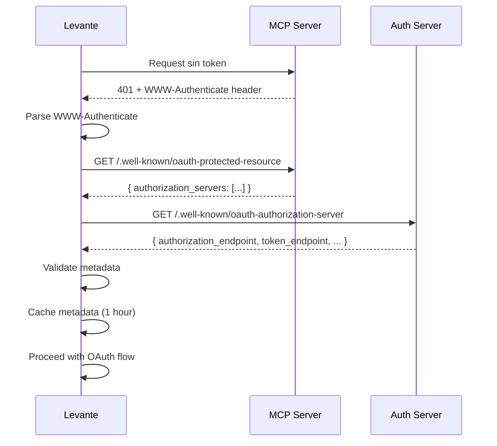

# Fase 3: Discovery Automático - Plan de Implementación Detallado

## Información del Documento

- **Fase**: 3 - Discovery Automático de Authorization Servers
- **Fecha**: 2025-12-21
- **Estado**: Listo para implementación
- **Duración estimada**: 1-2 semanas
- **Dependencias**: Fase 1 y 2 completadas (Token Store + OAuth Flow)
- **Autor**: Arquitectura Levante

## Índice

1. [Objetivos de la Fase 3](#objetivos-de-la-fase-3)
2. [Arquitectura y Decisiones](#arquitectura-y-decisiones)
3. [Estructura de Archivos](#estructura-de-archivos)
4. [Plan de Implementación Paso a Paso](#plan-de-implementación-paso-a-paso)
5. [Testing](#testing)
6. [Validación Final](#validación-final)

---

## Objetivos de la Fase 3

### Objetivos Principales

1. ✅ Implementar RFC 9728 (Protected Resource Metadata Discovery)
2. ✅ Implementar RFC 8414 (Authorization Server Metadata Discovery)
3. ✅ Parsear y procesar headers `WWW-Authenticate`
4. ✅ Cache de metadata para optimizar performance
5. ✅ Validación completa de metadata según especificaciones
6. ✅ Manejo de errores robusto para discovery failures

### Alcance

**Incluye:**
- OAuthDiscoveryService completo
- Discovery de authorization servers desde MCP servers
- Fetching de metadata de authorization servers
- Parsing de WWW-Authenticate headers
- Cache de metadata con TTL
- Validación de metadata según RFCs
- Tests unitarios completos

**No incluye:**
- Integración con HTTP clients de MCP (Fase 4)
- Dynamic Client Registration (Fase 5)
- UI components (Fase 6)
- Revocación de tokens (Fase 6)

---

## Arquitectura y Decisiones

### Flujo de Discovery Automático



### Decisiones Clave

**1. Discovery de Protected Resource (RFC 9728)**
- **Decisión**: Implementar discovery automático desde MCP server
- **Justificación**: MCP servers pueden indicar su authorization server sin configuración manual
- **Endpoint**: `/.well-known/oauth-protected-resource`
- **Validación**: Verificar que `resource` URI coincida con el origin del MCP server

**2. Discovery de Authorization Server (RFC 8414)**
- **Decisión**: Fetch metadata completo del authorization server
- **Justificación**: Obtener endpoints y capacidades sin hardcoding
- **Endpoint**: `/.well-known/oauth-authorization-server`
- **Validación**: Verificar campos obligatorios y soporte PKCE S256

**3. WWW-Authenticate Header Parsing**
- **Decisión**: Parsear header para obtener URL de metadata
- **Justificación**: Permite discovery incluso sin conocer el MCP server de antemano
- **Formato**: `Bearer realm="mcp", resource_metadata="https://..."`

**4. Cache de Metadata**
- **Decisión**: Cache en memoria con TTL de 1 hora
- **Justificación**: Reducir latencia y requests innecesarios
- **Implementación**: Map con auto-cleanup
- **TTL**: 1 hora (configurable)

**5. Validación de Metadata**
- **Decisión**: Validación estricta según RFCs
- **Campos obligatorios**:
  - `issuer` (RFC 8414)
  - `authorization_endpoint`
  - `token_endpoint`
  - `response_types_supported`
  - `code_challenge_methods_supported` (debe incluir S256)
- **Validación adicional**: Verificar HTTPS para endpoints (excepto localhost)

---

## Estructura de Archivos

### Nuevos Archivos a Crear

```
src/main/services/oauth/
├── OAuthDiscoveryService.ts          # Discovery service completo
└── __tests__/
    └── OAuthDiscoveryService.test.ts # Unit tests
```

### Archivos a Modificar

```
src/main/services/oauth/
├── types.ts                          # Añadir nuevos tipos
└── index.ts                          # Exportar OAuthDiscoveryService
```

---

## Plan de Implementación Paso a Paso

### Paso 1: Extender Tipos TypeScript

**Archivo**: `src/main/services/oauth/types.ts`

**Añadir al final del archivo existente:**

```typescript
/**
 * OAuth Discovery Types - Fase 3
 */

/**
 * Protected Resource Metadata (RFC 9728)
 */
export interface ProtectedResourceMetadata {
  /** Resource server URL */
  resource: string;

  /** Array of authorization server URLs */
  authorization_servers: string[];

  /** Bearer token usage (opcional) */
  bearer_methods_supported?: string[];

  /** Resource documentation (opcional) */
  resource_documentation?: string;
}

/**
 * Authorization Server Metadata (RFC 8414)
 */
export interface AuthorizationServerMetadata {
  /** Issuer identifier */
  issuer: string;

  /** Authorization endpoint URL */
  authorization_endpoint: string;

  /** Token endpoint URL */
  token_endpoint: string;

  /** JWKS URI (opcional) */
  jwks_uri?: string;

  /** Registration endpoint (opcional) */
  registration_endpoint?: string;

  /** Scopes supported (opcional) */
  scopes_supported?: string[];

  /** Response types supported */
  response_types_supported: string[];

  /** Response modes supported (opcional) */
  response_modes_supported?: string[];

  /** Grant types supported (opcional) */
  grant_types_supported?: string[];

  /** Token endpoint auth methods (opcional) */
  token_endpoint_auth_methods_supported?: string[];

  /** Token endpoint auth signing algs (opcional) */
  token_endpoint_auth_signing_alg_values_supported?: string[];

  /** Service documentation (opcional) */
  service_documentation?: string;

  /** UI locales supported (opcional) */
  ui_locales_supported?: string[];

  /** OP policy URI (opcional) */
  op_policy_uri?: string;

  /** OP ToS URI (opcional) */
  op_tos_uri?: string;

  /** Revocation endpoint (opcional) */
  revocation_endpoint?: string;

  /** Revocation endpoint auth methods (opcional) */
  revocation_endpoint_auth_methods_supported?: string[];

  /** Introspection endpoint (opcional) */
  introspection_endpoint?: string;

  /** Code challenge methods supported */
  code_challenge_methods_supported: string[];

  /** DPOP signing algs supported (opcional) */
  dpop_signing_alg_values_supported?: string[];
}

/**
 * WWW-Authenticate header parsed data
 */
export interface WWWAuthenticateParams {
  /** Authentication scheme (e.g., "Bearer") */
  scheme?: string;

  /** Realm parameter */
  realm?: string;

  /** Authorization server URI */
  as_uri?: string;

  /** Resource metadata URL */
  resource_metadata?: string;

  /** Error code */
  error?: string;

  /** Error description */
  error_description?: string;

  /** Scope required */
  scope?: string;
}

/**
 * Metadata cache entry
 */
export interface CachedMetadata<T> {
  /** Cached data */
  data: T;

  /** Cache timestamp */
  cachedAt: number;

  /** Expiration timestamp */
  expiresAt: number;
}

/**
 * Discovery result
 */
export interface DiscoveryResult {
  /** Authorization server URL */
  authorizationServer: string;

  /** Authorization server metadata */
  metadata: AuthorizationServerMetadata;

  /** Was retrieved from cache */
  fromCache: boolean;
}

/**
 * Errores relacionados con OAuth Discovery
 */
export class OAuthDiscoveryError extends Error {
  constructor(
    message: string,
    public readonly code:
      | 'METADATA_FETCH_FAILED'
      | 'INVALID_METADATA'
      | 'PKCE_NOT_SUPPORTED'
      | 'NETWORK_ERROR'
      | 'VALIDATION_FAILED'
      | 'PARSE_ERROR',
    public readonly details?: any
  ) {
    super(message);
    this.name = 'OAuthDiscoveryError';
  }
}
```

---

### Paso 2: Implementar OAuthDiscoveryService

**Archivo**: `src/main/services/oauth/OAuthDiscoveryService.ts`

```typescript
import { getLogger } from '../logging';
import type {
  ProtectedResourceMetadata,
  AuthorizationServerMetadata,
  WWWAuthenticateParams,
  CachedMetadata,
  DiscoveryResult,
} from './types';
import { OAuthDiscoveryError } from './types';

/**
 * OAuthDiscoveryService
 *
 * Implementa discovery automático de OAuth 2.1 según:
 * - RFC 9728: OAuth 2.0 Protected Resource Metadata
 * - RFC 8414: OAuth 2.0 Authorization Server Metadata
 *
 * Features:
 * - Discovery de authorization servers desde protected resources
 * - Fetching de metadata de authorization servers
 * - Parsing de WWW-Authenticate headers
 * - Cache de metadata con TTL
 * - Validación completa según RFCs
 */
export class OAuthDiscoveryService {
  private logger = getLogger();
  private metadataCache = new Map<string, CachedMetadata<AuthorizationServerMetadata>>();
  private resourceCache = new Map<string, CachedMetadata<ProtectedResourceMetadata>>();

  private readonly DEFAULT_CACHE_TTL = 60 * 60 * 1000; // 1 hora
  private readonly PROTECTED_RESOURCE_PATH = '/.well-known/oauth-protected-resource';
  private readonly AUTH_SERVER_PATH = '/.well-known/oauth-authorization-server';

  /**
   * Descubre authorization servers desde un protected resource (MCP server)
   * Implementa RFC 9728
   */
  async discoverAuthServer(resourceUrl: string): Promise<ProtectedResourceMetadata> {
    try {
      this.logger.mcp.info('Discovering authorization servers', {
        resourceUrl,
      });

      // Check cache first
      const cached = this.getFromCache(this.resourceCache, resourceUrl);
      if (cached) {
        this.logger.mcp.debug('Using cached protected resource metadata', {
          resourceUrl,
        });
        return cached;
      }

      // Construir metadata URL
      const metadataUrl = this.buildMetadataUrl(
        resourceUrl,
        this.PROTECTED_RESOURCE_PATH
      );

      this.logger.mcp.debug('Fetching protected resource metadata', {
        metadataUrl,
      });

      // Fetch metadata
      const response = await fetch(metadataUrl, {
        method: 'GET',
        headers: {
          Accept: 'application/json',
        },
      });

      if (!response.ok) {
        throw new OAuthDiscoveryError(
          `Failed to fetch protected resource metadata: ${response.status} ${response.statusText}`,
          'METADATA_FETCH_FAILED',
          {
            status: response.status,
            statusText: response.statusText,
            url: metadataUrl,
          }
        );
      }

      const metadata = (await response.json()) as ProtectedResourceMetadata;

      // Validar metadata
      this.validateProtectedResourceMetadata(metadata, resourceUrl);

      // Cache metadata
      this.saveToCache(this.resourceCache, resourceUrl, metadata);

      this.logger.mcp.info('Authorization servers discovered', {
        resourceUrl,
        authorizationServers: metadata.authorization_servers,
      });

      return metadata;
    } catch (error) {
      if (error instanceof OAuthDiscoveryError) {
        throw error;
      }

      this.logger.mcp.error('Failed to discover authorization servers', {
        resourceUrl,
        error: error instanceof Error ? error.message : error,
      });

      throw new OAuthDiscoveryError(
        'Failed to discover authorization servers',
        'NETWORK_ERROR',
        { error, resourceUrl }
      );
    }
  }

  /**
   * Obtiene metadata completo de un authorization server
   * Implementa RFC 8414
   */
  async fetchServerMetadata(
    authServerUrl: string
  ): Promise<AuthorizationServerMetadata> {
    try {
      this.logger.core.info('Fetching authorization server metadata', {
        authServerUrl,
      });

      // Check cache first
      const cached = this.getFromCache(this.metadataCache, authServerUrl);
      if (cached) {
        this.logger.core.debug('Using cached authorization server metadata', {
          authServerUrl,
        });
        return cached;
      }

      // Construir metadata URL
      const metadataUrl = this.buildMetadataUrl(
        authServerUrl,
        this.AUTH_SERVER_PATH
      );

      this.logger.core.debug('Fetching metadata from URL', {
        metadataUrl,
      });

      // Fetch metadata
      const response = await fetch(metadataUrl, {
        method: 'GET',
        headers: {
          Accept: 'application/json',
        },
      });

      if (!response.ok) {
        throw new OAuthDiscoveryError(
          `Failed to fetch authorization server metadata: ${response.status} ${response.statusText}`,
          'METADATA_FETCH_FAILED',
          {
            status: response.status,
            statusText: response.statusText,
            url: metadataUrl,
          }
        );
      }

      const metadata = (await response.json()) as AuthorizationServerMetadata;

      // Validar metadata
      this.validateAuthServerMetadata(metadata, authServerUrl);

      // Cache metadata
      this.saveToCache(this.metadataCache, authServerUrl, metadata);

      this.logger.core.info('Authorization server metadata fetched', {
        authServerUrl,
        authorizationEndpoint: metadata.authorization_endpoint,
        tokenEndpoint: metadata.token_endpoint,
        hasRegistrationEndpoint: !!metadata.registration_endpoint,
      });

      return metadata;
    } catch (error) {
      if (error instanceof OAuthDiscoveryError) {
        throw error;
      }

      this.logger.core.error('Failed to fetch authorization server metadata', {
        authServerUrl,
        error: error instanceof Error ? error.message : error,
      });

      throw new OAuthDiscoveryError(
        'Failed to fetch authorization server metadata',
        'NETWORK_ERROR',
        { error, authServerUrl }
      );
    }
  }

  /**
   * Parsea WWW-Authenticate header
   * Formato: Bearer realm="mcp", resource_metadata="https://..."
   */
  parseWWWAuthenticate(header: string): WWWAuthenticateParams {
    try {
      this.logger.core.debug('Parsing WWW-Authenticate header', {
        headerLength: header.length,
      });

      const result: WWWAuthenticateParams = {};

      // Extraer scheme (e.g., "Bearer")
      const schemeMatch = header.match(/^(\w+)\s+/);
      if (schemeMatch) {
        result.scheme = schemeMatch[1];
      }

      // Extraer parámetros
      // Formato: key="value" o key=value
      const paramRegex = /(\w+)=(?:"([^"]*)"|([^\s,]*))/g;
      let match;

      while ((match = paramRegex.exec(header)) !== null) {
        const key = match[1];
        const value = match[2] || match[3]; // Quoted o unquoted

        switch (key) {
          case 'realm':
            result.realm = value;
            break;
          case 'as_uri':
            result.as_uri = value;
            break;
          case 'resource_metadata':
            result.resource_metadata = value;
            break;
          case 'error':
            result.error = value;
            break;
          case 'error_description':
            result.error_description = value;
            break;
          case 'scope':
            result.scope = value;
            break;
        }
      }

      this.logger.core.debug('WWW-Authenticate header parsed', {
        scheme: result.scheme,
        hasResourceMetadata: !!result.resource_metadata,
        hasAsUri: !!result.as_uri,
        hasError: !!result.error,
      });

      return result;
    } catch (error) {
      this.logger.core.error('Failed to parse WWW-Authenticate header', {
        error: error instanceof Error ? error.message : error,
      });

      throw new OAuthDiscoveryError(
        'Failed to parse WWW-Authenticate header',
        'PARSE_ERROR',
        { error, header }
      );
    }
  }

  /**
   * Discovery completo desde un MCP server con 401 response
   * 1. Parse WWW-Authenticate header (si existe)
   * 2. Discover protected resource metadata
   * 3. Fetch authorization server metadata
   */
  async discoverFromUnauthorized(
    resourceUrl: string,
    wwwAuthenticateHeader?: string
  ): Promise<DiscoveryResult> {
    try {
      this.logger.mcp.info('Starting discovery from unauthorized response', {
        resourceUrl,
        hasWWWAuthenticate: !!wwwAuthenticateHeader,
      });

      // 1. Parse WWW-Authenticate header si existe
      let asUri: string | undefined;
      if (wwwAuthenticateHeader) {
        const parsed = this.parseWWWAuthenticate(wwwAuthenticateHeader);
        asUri = parsed.as_uri;

        this.logger.mcp.debug('WWW-Authenticate parsed', {
          asUri,
          resourceMetadata: parsed.resource_metadata,
        });
      }

      // 2. Discover authorization servers
      const protectedResource = await this.discoverAuthServer(resourceUrl);

      // 3. Seleccionar authorization server
      // Prioridad: as_uri del header > primer servidor en la lista
      const authServerUrl =
        asUri || protectedResource.authorization_servers[0];

      if (!authServerUrl) {
        throw new OAuthDiscoveryError(
          'No authorization server found',
          'INVALID_METADATA',
          { protectedResource }
        );
      }

      // 4. Fetch authorization server metadata
      const metadata = await this.fetchServerMetadata(authServerUrl);

      this.logger.mcp.info('Discovery completed', {
        resourceUrl,
        authorizationServer: authServerUrl,
        fromCache: false,
      });

      return {
        authorizationServer: authServerUrl,
        metadata,
        fromCache: false,
      };
    } catch (error) {
      this.logger.mcp.error('Discovery from unauthorized failed', {
        resourceUrl,
        error: error instanceof Error ? error.message : error,
      });

      throw error;
    }
  }

  /**
   * Limpia metadata expirado del cache
   */
  cleanExpiredCache(): number {
    const now = Date.now();
    let cleanedCount = 0;

    // Limpiar metadata cache
    for (const [key, cached] of this.metadataCache.entries()) {
      if (now >= cached.expiresAt) {
        this.metadataCache.delete(key);
        cleanedCount++;
      }
    }

    // Limpiar resource cache
    for (const [key, cached] of this.resourceCache.entries()) {
      if (now >= cached.expiresAt) {
        this.resourceCache.delete(key);
        cleanedCount++;
      }
    }

    if (cleanedCount > 0) {
      this.logger.core.debug('Expired metadata cache cleaned', {
        count: cleanedCount,
      });
    }

    return cleanedCount;
  }

  /**
   * Limpia todo el cache (útil para testing)
   */
  clearCache(): void {
    const totalCount =
      this.metadataCache.size + this.resourceCache.size;

    this.metadataCache.clear();
    this.resourceCache.clear();

    this.logger.core.debug('All metadata cache cleared', {
      count: totalCount,
    });
  }

  /**
   * Obtiene estadísticas del cache
   */
  getCacheStats() {
    return {
      metadataCount: this.metadataCache.size,
      resourceCount: this.resourceCache.size,
      total: this.metadataCache.size + this.resourceCache.size,
    };
  }

  // ========== Private Methods ==========

  /**
   * Construye URL de metadata
   */
  private buildMetadataUrl(baseUrl: string, path: string): string {
    const url = new URL(baseUrl);
    url.pathname = path;
    return url.toString();
  }

  /**
   * Valida metadata de protected resource (RFC 9728)
   */
  private validateProtectedResourceMetadata(
    metadata: ProtectedResourceMetadata,
    resourceUrl: string
  ): void {
    // Verificar campo obligatorio: resource
    if (!metadata.resource) {
      throw new OAuthDiscoveryError(
        'Protected resource metadata missing "resource" field',
        'INVALID_METADATA',
        { metadata }
      );
    }

    // Verificar campo obligatorio: authorization_servers
    if (
      !metadata.authorization_servers ||
      !Array.isArray(metadata.authorization_servers) ||
      metadata.authorization_servers.length === 0
    ) {
      throw new OAuthDiscoveryError(
        'Protected resource metadata missing or invalid "authorization_servers"',
        'INVALID_METADATA',
        { metadata }
      );
    }

    // RFC 9728 Section 7.6: Validar que resource URI coincida con el origin
    const resourceUri = new URL(metadata.resource);
    const actualUri = new URL(resourceUrl);

    if (resourceUri.origin !== actualUri.origin) {
      throw new OAuthDiscoveryError(
        'Resource URI in metadata does not match actual resource origin',
        'VALIDATION_FAILED',
        {
          metadataResource: metadata.resource,
          actualResource: resourceUrl,
        }
      );
    }

    this.logger.mcp.debug('Protected resource metadata validated', {
      resource: metadata.resource,
      authServerCount: metadata.authorization_servers.length,
    });
  }

  /**
   * Valida metadata de authorization server (RFC 8414)
   */
  private validateAuthServerMetadata(
    metadata: AuthorizationServerMetadata,
    authServerUrl: string
  ): void {
    // Campos obligatorios según RFC 8414
    const requiredFields = [
      'issuer',
      'authorization_endpoint',
      'token_endpoint',
      'response_types_supported',
    ] as const;

    for (const field of requiredFields) {
      if (!metadata[field]) {
        throw new OAuthDiscoveryError(
          `Authorization server metadata missing required field: ${field}`,
          'INVALID_METADATA',
          { metadata, missingField: field }
        );
      }
    }

    // Validar que el issuer coincida con el auth server URL
    // RFC 8414 Section 3: issuer debe ser el mismo que la URL del AS
    const issuerUrl = new URL(metadata.issuer);
    const asUrl = new URL(authServerUrl);

    if (issuerUrl.origin !== asUrl.origin) {
      this.logger.core.warn('Issuer origin does not match auth server origin', {
        issuer: metadata.issuer,
        authServerUrl,
      });
      // No lanzar error, solo advertencia (algunos servers pueden tener discrepancias)
    }

    // Validar PKCE support (OAuth 2.1 requirement)
    if (!metadata.code_challenge_methods_supported) {
      throw new OAuthDiscoveryError(
        'Authorization server does not advertise PKCE support',
        'PKCE_NOT_SUPPORTED',
        { metadata }
      );
    }

    if (!metadata.code_challenge_methods_supported.includes('S256')) {
      throw new OAuthDiscoveryError(
        'Authorization server does not support PKCE with S256',
        'PKCE_NOT_SUPPORTED',
        {
          metadata,
          supportedMethods: metadata.code_challenge_methods_supported,
        }
      );
    }

    // Validar HTTPS para endpoints (excepto localhost)
    const endpoints = [
      metadata.authorization_endpoint,
      metadata.token_endpoint,
      metadata.revocation_endpoint,
      metadata.registration_endpoint,
    ].filter(Boolean) as string[];

    for (const endpoint of endpoints) {
      this.validateEndpointUrl(endpoint);
    }

    this.logger.core.debug('Authorization server metadata validated', {
      issuer: metadata.issuer,
      supportsPKCE: true,
      hasRegistrationEndpoint: !!metadata.registration_endpoint,
      hasRevocationEndpoint: !!metadata.revocation_endpoint,
    });
  }

  /**
   * Valida que un endpoint use HTTPS (excepto localhost)
   */
  private validateEndpointUrl(url: string): void {
    const parsed = new URL(url);

    // Permitir http solo para localhost/127.0.0.1
    if (parsed.protocol === 'http:') {
      const isLocalhost =
        parsed.hostname === 'localhost' ||
        parsed.hostname === '127.0.0.1' ||
        parsed.hostname === '[::1]';

      if (!isLocalhost) {
        this.logger.core.warn('Endpoint using HTTP instead of HTTPS', {
          url,
          hostname: parsed.hostname,
        });
        // No lanzar error, solo advertencia (algunos servers de desarrollo pueden usar HTTP)
      }
    }
  }

  /**
   * Obtiene valor del cache si existe y no está expirado
   */
  private getFromCache<T>(
    cache: Map<string, CachedMetadata<T>>,
    key: string
  ): T | null {
    const cached = cache.get(key);

    if (!cached) {
      return null;
    }

    // Verificar expiración
    if (Date.now() >= cached.expiresAt) {
      cache.delete(key);
      return null;
    }

    return cached.data;
  }

  /**
   * Guarda valor en cache con TTL
   */
  private saveToCache<T>(
    cache: Map<string, CachedMetadata<T>>,
    key: string,
    data: T,
    ttl: number = this.DEFAULT_CACHE_TTL
  ): void {
    const now = Date.now();

    cache.set(key, {
      data,
      cachedAt: now,
      expiresAt: now + ttl,
    });

    // Auto-cleanup después del TTL
    setTimeout(() => {
      cache.delete(key);
    }, ttl);
  }
}
```

---

### Paso 3: Actualizar Index para Exports

**Archivo**: `src/main/services/oauth/index.ts`

**Modificar para añadir nuevos exports:**

```typescript
/**
 * OAuth Services
 *
 * Fase 1: Token Store Seguro
 * Fase 2: OAuth Flow con PKCE
 * Fase 3: Discovery Automático
 */

// Fase 1
export { OAuthTokenStore } from './OAuthTokenStore';

// Fase 2
export { OAuthFlowManager } from './OAuthFlowManager';
export { OAuthRedirectServer } from './OAuthRedirectServer';
export { OAuthStateManager } from './OAuthStateManager';

// Fase 3
export { OAuthDiscoveryService } from './OAuthDiscoveryService';

// Types
export type {
  OAuthTokens,
  StoredOAuthTokens,
  OAuthConfig,
  MCPServerConfigWithOAuth,
  UIPreferencesWithOAuth,
  PKCEParams,
  AuthorizationUrlParams,
  TokenExchangeParams,
  TokenRefreshParams,
  AuthorizationCallback,
  LoopbackServerConfig,
  LoopbackServerResult,
  StoredState,
  ProtectedResourceMetadata,
  AuthorizationServerMetadata,
  WWWAuthenticateParams,
  CachedMetadata,
  DiscoveryResult,
} from './types';

export {
  OAuthTokenStoreError,
  OAuthFlowError,
  OAuthDiscoveryError,
} from './types';
```

---

## Testing

### Paso 4: Tests Unitarios - OAuthDiscoveryService

**Archivo**: `src/main/services/oauth/__tests__/OAuthDiscoveryService.test.ts`

```typescript
import { describe, it, expect, beforeEach, vi, afterEach } from 'vitest';
import { OAuthDiscoveryService } from '../OAuthDiscoveryService';
import { OAuthDiscoveryError } from '../types';
import type {
  ProtectedResourceMetadata,
  AuthorizationServerMetadata,
} from '../types';

// Mock logger
vi.mock('../../logging', () => ({
  getLogger: () => ({
    core: {
      info: vi.fn(),
      debug: vi.fn(),
      warn: vi.fn(),
      error: vi.fn(),
    },
    mcp: {
      info: vi.fn(),
      debug: vi.fn(),
      warn: vi.fn(),
      error: vi.fn(),
    },
  }),
}));

describe('OAuthDiscoveryService', () => {
  let discoveryService: OAuthDiscoveryService;

  beforeEach(() => {
    discoveryService = new OAuthDiscoveryService();
    vi.clearAllMocks();
  });

  afterEach(() => {
    discoveryService.clearCache();
  });

  describe('discoverAuthServer', () => {
    it('should discover authorization servers from protected resource', async () => {
      const mockMetadata: ProtectedResourceMetadata = {
        resource: 'https://mcp.example.com',
        authorization_servers: ['https://auth.example.com'],
      };

      global.fetch = vi.fn().mockResolvedValue({
        ok: true,
        json: async () => mockMetadata,
      });

      const result = await discoveryService.discoverAuthServer(
        'https://mcp.example.com'
      );

      expect(result.resource).toBe('https://mcp.example.com');
      expect(result.authorization_servers).toHaveLength(1);
      expect(result.authorization_servers[0]).toBe('https://auth.example.com');

      // Verify fetch was called with correct URL
      expect(global.fetch).toHaveBeenCalledWith(
        'https://mcp.example.com/.well-known/oauth-protected-resource',
        expect.objectContaining({
          method: 'GET',
          headers: expect.objectContaining({
            Accept: 'application/json',
          }),
        })
      );
    });

    it('should use cached metadata if available', async () => {
      const mockMetadata: ProtectedResourceMetadata = {
        resource: 'https://mcp.example.com',
        authorization_servers: ['https://auth.example.com'],
      };

      global.fetch = vi.fn().mockResolvedValue({
        ok: true,
        json: async () => mockMetadata,
      });

      // Primera llamada - fetch
      await discoveryService.discoverAuthServer('https://mcp.example.com');

      // Segunda llamada - debe usar cache
      const result = await discoveryService.discoverAuthServer(
        'https://mcp.example.com'
      );

      expect(result.resource).toBe('https://mcp.example.com');
      // Fetch debe haber sido llamado solo una vez
      expect(global.fetch).toHaveBeenCalledTimes(1);
    });

    it('should throw error if metadata fetch fails', async () => {
      global.fetch = vi.fn().mockResolvedValue({
        ok: false,
        status: 404,
        statusText: 'Not Found',
      });

      await expect(
        discoveryService.discoverAuthServer('https://mcp.example.com')
      ).rejects.toThrow(OAuthDiscoveryError);

      await expect(
        discoveryService.discoverAuthServer('https://mcp.example.com')
      ).rejects.toThrow('Failed to fetch protected resource metadata');
    });

    it('should throw error if resource field is missing', async () => {
      const invalidMetadata = {
        authorization_servers: ['https://auth.example.com'],
        // Falta "resource"
      };

      global.fetch = vi.fn().mockResolvedValue({
        ok: true,
        json: async () => invalidMetadata,
      });

      await expect(
        discoveryService.discoverAuthServer('https://mcp.example.com')
      ).rejects.toThrow('missing "resource" field');
    });

    it('should throw error if authorization_servers is missing', async () => {
      const invalidMetadata = {
        resource: 'https://mcp.example.com',
        // Falta "authorization_servers"
      };

      global.fetch = vi.fn().mockResolvedValue({
        ok: true,
        json: async () => invalidMetadata,
      });

      await expect(
        discoveryService.discoverAuthServer('https://mcp.example.com')
      ).rejects.toThrow('missing or invalid "authorization_servers"');
    });

    it('should throw error if resource origin does not match', async () => {
      const invalidMetadata: ProtectedResourceMetadata = {
        resource: 'https://different-origin.com', // Diferente origin
        authorization_servers: ['https://auth.example.com'],
      };

      global.fetch = vi.fn().mockResolvedValue({
        ok: true,
        json: async () => invalidMetadata,
      });

      await expect(
        discoveryService.discoverAuthServer('https://mcp.example.com')
      ).rejects.toThrow('does not match actual resource origin');
    });
  });

  describe('fetchServerMetadata', () => {
    it('should fetch authorization server metadata', async () => {
      const mockMetadata: AuthorizationServerMetadata = {
        issuer: 'https://auth.example.com',
        authorization_endpoint: 'https://auth.example.com/authorize',
        token_endpoint: 'https://auth.example.com/token',
        response_types_supported: ['code'],
        code_challenge_methods_supported: ['S256'],
      };

      global.fetch = vi.fn().mockResolvedValue({
        ok: true,
        json: async () => mockMetadata,
      });

      const result = await discoveryService.fetchServerMetadata(
        'https://auth.example.com'
      );

      expect(result.issuer).toBe('https://auth.example.com');
      expect(result.authorization_endpoint).toBe(
        'https://auth.example.com/authorize'
      );
      expect(result.token_endpoint).toBe('https://auth.example.com/token');
      expect(result.code_challenge_methods_supported).toContain('S256');

      // Verify fetch was called with correct URL
      expect(global.fetch).toHaveBeenCalledWith(
        'https://auth.example.com/.well-known/oauth-authorization-server',
        expect.objectContaining({
          method: 'GET',
          headers: expect.objectContaining({
            Accept: 'application/json',
          }),
        })
      );
    });

    it('should use cached metadata if available', async () => {
      const mockMetadata: AuthorizationServerMetadata = {
        issuer: 'https://auth.example.com',
        authorization_endpoint: 'https://auth.example.com/authorize',
        token_endpoint: 'https://auth.example.com/token',
        response_types_supported: ['code'],
        code_challenge_methods_supported: ['S256'],
      };

      global.fetch = vi.fn().mockResolvedValue({
        ok: true,
        json: async () => mockMetadata,
      });

      // Primera llamada
      await discoveryService.fetchServerMetadata('https://auth.example.com');

      // Segunda llamada - debe usar cache
      const result = await discoveryService.fetchServerMetadata(
        'https://auth.example.com'
      );

      expect(result.issuer).toBe('https://auth.example.com');
      expect(global.fetch).toHaveBeenCalledTimes(1);
    });

    it('should throw error if metadata fetch fails', async () => {
      global.fetch = vi.fn().mockResolvedValue({
        ok: false,
        status: 500,
        statusText: 'Internal Server Error',
      });

      await expect(
        discoveryService.fetchServerMetadata('https://auth.example.com')
      ).rejects.toThrow('Failed to fetch authorization server metadata');
    });

    it('should throw error if required fields are missing', async () => {
      const invalidMetadata = {
        issuer: 'https://auth.example.com',
        // Faltan campos obligatorios
      };

      global.fetch = vi.fn().mockResolvedValue({
        ok: true,
        json: async () => invalidMetadata,
      });

      await expect(
        discoveryService.fetchServerMetadata('https://auth.example.com')
      ).rejects.toThrow('missing required field');
    });

    it('should throw error if PKCE is not supported', async () => {
      const invalidMetadata: Partial<AuthorizationServerMetadata> = {
        issuer: 'https://auth.example.com',
        authorization_endpoint: 'https://auth.example.com/authorize',
        token_endpoint: 'https://auth.example.com/token',
        response_types_supported: ['code'],
        // No code_challenge_methods_supported
      };

      global.fetch = vi.fn().mockResolvedValue({
        ok: true,
        json: async () => invalidMetadata,
      });

      await expect(
        discoveryService.fetchServerMetadata('https://auth.example.com')
      ).rejects.toThrow('does not advertise PKCE support');
    });

    it('should throw error if PKCE S256 is not supported', async () => {
      const invalidMetadata: Partial<AuthorizationServerMetadata> = {
        issuer: 'https://auth.example.com',
        authorization_endpoint: 'https://auth.example.com/authorize',
        token_endpoint: 'https://auth.example.com/token',
        response_types_supported: ['code'],
        code_challenge_methods_supported: ['plain'], // Solo plain, no S256
      };

      global.fetch = vi.fn().mockResolvedValue({
        ok: true,
        json: async () => invalidMetadata,
      });

      await expect(
        discoveryService.fetchServerMetadata('https://auth.example.com')
      ).rejects.toThrow('does not support PKCE with S256');
    });

    it('should accept metadata with optional fields', async () => {
      const fullMetadata: AuthorizationServerMetadata = {
        issuer: 'https://auth.example.com',
        authorization_endpoint: 'https://auth.example.com/authorize',
        token_endpoint: 'https://auth.example.com/token',
        response_types_supported: ['code'],
        code_challenge_methods_supported: ['S256'],
        registration_endpoint: 'https://auth.example.com/register',
        revocation_endpoint: 'https://auth.example.com/revoke',
        scopes_supported: ['mcp:read', 'mcp:write'],
        grant_types_supported: ['authorization_code', 'refresh_token'],
      };

      global.fetch = vi.fn().mockResolvedValue({
        ok: true,
        json: async () => fullMetadata,
      });

      const result = await discoveryService.fetchServerMetadata(
        'https://auth.example.com'
      );

      expect(result.registration_endpoint).toBe(
        'https://auth.example.com/register'
      );
      expect(result.revocation_endpoint).toBe(
        'https://auth.example.com/revoke'
      );
      expect(result.scopes_supported).toContain('mcp:read');
    });
  });

  describe('parseWWWAuthenticate', () => {
    it('should parse Bearer header with quoted values', () => {
      const header =
        'Bearer realm="mcp", resource_metadata="https://mcp.example.com/.well-known/oauth-protected-resource"';

      const result = discoveryService.parseWWWAuthenticate(header);

      expect(result.scheme).toBe('Bearer');
      expect(result.realm).toBe('mcp');
      expect(result.resource_metadata).toBe(
        'https://mcp.example.com/.well-known/oauth-protected-resource'
      );
    });

    it('should parse header with as_uri parameter', () => {
      const header =
        'Bearer realm="mcp", as_uri="https://auth.example.com"';

      const result = discoveryService.parseWWWAuthenticate(header);

      expect(result.scheme).toBe('Bearer');
      expect(result.as_uri).toBe('https://auth.example.com');
    });

    it('should parse header with error parameters', () => {
      const header =
        'Bearer error="invalid_token", error_description="Token expired"';

      const result = discoveryService.parseWWWAuthenticate(header);

      expect(result.error).toBe('invalid_token');
      expect(result.error_description).toBe('Token expired');
    });

    it('should parse header with scope parameter', () => {
      const header = 'Bearer realm="mcp", scope="mcp:read mcp:write"';

      const result = discoveryService.parseWWWAuthenticate(header);

      expect(result.scope).toBe('mcp:read mcp:write');
    });

    it('should handle unquoted values', () => {
      const header = 'Bearer realm=mcp, scope=read';

      const result = discoveryService.parseWWWAuthenticate(header);

      expect(result.realm).toBe('mcp');
      expect(result.scope).toBe('read');
    });

    it('should handle empty header', () => {
      const result = discoveryService.parseWWWAuthenticate('');

      expect(result).toEqual({});
    });

    it('should handle header without scheme', () => {
      const header = 'realm="mcp"';

      const result = discoveryService.parseWWWAuthenticate(header);

      expect(result.scheme).toBeUndefined();
      expect(result.realm).toBe('mcp');
    });
  });

  describe('discoverFromUnauthorized', () => {
    it('should perform full discovery flow', async () => {
      const resourceMetadata: ProtectedResourceMetadata = {
        resource: 'https://mcp.example.com',
        authorization_servers: ['https://auth.example.com'],
      };

      const serverMetadata: AuthorizationServerMetadata = {
        issuer: 'https://auth.example.com',
        authorization_endpoint: 'https://auth.example.com/authorize',
        token_endpoint: 'https://auth.example.com/token',
        response_types_supported: ['code'],
        code_challenge_methods_supported: ['S256'],
      };

      global.fetch = vi
        .fn()
        .mockResolvedValueOnce({
          ok: true,
          json: async () => resourceMetadata,
        })
        .mockResolvedValueOnce({
          ok: true,
          json: async () => serverMetadata,
        });

      const result = await discoveryService.discoverFromUnauthorized(
        'https://mcp.example.com'
      );

      expect(result.authorizationServer).toBe('https://auth.example.com');
      expect(result.metadata.issuer).toBe('https://auth.example.com');
      expect(result.fromCache).toBe(false);
    });

    it('should use as_uri from WWW-Authenticate header', async () => {
      const wwwAuth = 'Bearer as_uri="https://custom-auth.example.com"';

      const resourceMetadata: ProtectedResourceMetadata = {
        resource: 'https://mcp.example.com',
        authorization_servers: ['https://auth.example.com'],
      };

      const serverMetadata: AuthorizationServerMetadata = {
        issuer: 'https://custom-auth.example.com',
        authorization_endpoint: 'https://custom-auth.example.com/authorize',
        token_endpoint: 'https://custom-auth.example.com/token',
        response_types_supported: ['code'],
        code_challenge_methods_supported: ['S256'],
      };

      global.fetch = vi
        .fn()
        .mockResolvedValueOnce({
          ok: true,
          json: async () => resourceMetadata,
        })
        .mockResolvedValueOnce({
          ok: true,
          json: async () => serverMetadata,
        });

      const result = await discoveryService.discoverFromUnauthorized(
        'https://mcp.example.com',
        wwwAuth
      );

      // Debe usar as_uri del header, no el primer servidor de la lista
      expect(result.authorizationServer).toBe(
        'https://custom-auth.example.com'
      );
    });

    it('should throw error if no authorization server found', async () => {
      const resourceMetadata: ProtectedResourceMetadata = {
        resource: 'https://mcp.example.com',
        authorization_servers: [], // Array vacío
      };

      global.fetch = vi.fn().mockResolvedValue({
        ok: true,
        json: async () => resourceMetadata,
      });

      await expect(
        discoveryService.discoverFromUnauthorized('https://mcp.example.com')
      ).rejects.toThrow('No authorization server found');
    });
  });

  describe('cache management', () => {
    it('should clean expired cache entries', async () => {
      const mockMetadata: AuthorizationServerMetadata = {
        issuer: 'https://auth.example.com',
        authorization_endpoint: 'https://auth.example.com/authorize',
        token_endpoint: 'https://auth.example.com/token',
        response_types_supported: ['code'],
        code_challenge_methods_supported: ['S256'],
      };

      global.fetch = vi.fn().mockResolvedValue({
        ok: true,
        json: async () => mockMetadata,
      });

      // Fetch metadata
      await discoveryService.fetchServerMetadata('https://auth.example.com');

      // Verificar que está en cache
      let stats = discoveryService.getCacheStats();
      expect(stats.metadataCount).toBe(1);

      // Limpiar cache expirado (no debería eliminar nada todavía)
      const cleaned = discoveryService.cleanExpiredCache();
      expect(cleaned).toBe(0);

      // Cache debe seguir con 1 entrada
      stats = discoveryService.getCacheStats();
      expect(stats.metadataCount).toBe(1);
    });

    it('should clear all cache', async () => {
      const mockMetadata: AuthorizationServerMetadata = {
        issuer: 'https://auth.example.com',
        authorization_endpoint: 'https://auth.example.com/authorize',
        token_endpoint: 'https://auth.example.com/token',
        response_types_supported: ['code'],
        code_challenge_methods_supported: ['S256'],
      };

      global.fetch = vi.fn().mockResolvedValue({
        ok: true,
        json: async () => mockMetadata,
      });

      await discoveryService.fetchServerMetadata('https://auth.example.com');

      let stats = discoveryService.getCacheStats();
      expect(stats.metadataCount).toBe(1);

      discoveryService.clearCache();

      stats = discoveryService.getCacheStats();
      expect(stats.metadataCount).toBe(0);
      expect(stats.total).toBe(0);
    });

    it('should return cache statistics', async () => {
      const resourceMetadata: ProtectedResourceMetadata = {
        resource: 'https://mcp.example.com',
        authorization_servers: ['https://auth.example.com'],
      };

      const serverMetadata: AuthorizationServerMetadata = {
        issuer: 'https://auth.example.com',
        authorization_endpoint: 'https://auth.example.com/authorize',
        token_endpoint: 'https://auth.example.com/token',
        response_types_supported: ['code'],
        code_challenge_methods_supported: ['S256'],
      };

      global.fetch = vi
        .fn()
        .mockResolvedValueOnce({
          ok: true,
          json: async () => resourceMetadata,
        })
        .mockResolvedValueOnce({
          ok: true,
          json: async () => serverMetadata,
        });

      await discoveryService.discoverAuthServer('https://mcp.example.com');
      await discoveryService.fetchServerMetadata('https://auth.example.com');

      const stats = discoveryService.getCacheStats();

      expect(stats.resourceCount).toBe(1);
      expect(stats.metadataCount).toBe(1);
      expect(stats.total).toBe(2);
    });
  });
});
```

---

## Validación Final

### Checklist de Implementación

- [ ] **Tipos TypeScript extendidos** (`oauth/types.ts`)
- [ ] **OAuthDiscoveryService implementado** completo
- [ ] **Index exports actualizado** (`oauth/index.ts`)
- [ ] **Tests unitarios pasando** (OAuthDiscoveryService)
- [ ] **No hay warnings de TypeScript**
- [ ] **Logging configurado** correctamente
- [ ] **Cache funcionando** con TTL
- [ ] **Validación de metadata** según RFCs

### Validación Manual

**Script de validación** (ejecutar en main process):

```typescript
import { OAuthDiscoveryService } from './services/oauth';

async function testDiscoveryService() {
  const discovery = new OAuthDiscoveryService();

  console.log('=== OAuth Discovery Validation ===\n');

  try {
    // 1. Test WWW-Authenticate parsing
    console.log('1. Testing WWW-Authenticate parsing...');
    const wwwAuth =
      'Bearer realm="mcp", as_uri="https://auth.example.com", resource_metadata="https://mcp.example.com/.well-known/oauth-protected-resource"';

    const parsed = discovery.parseWWWAuthenticate(wwwAuth);
    console.log('   ✅ Scheme:', parsed.scheme);
    console.log('   ✅ Realm:', parsed.realm);
    console.log('   ✅ AS URI:', parsed.as_uri);
    console.log('   ✅ Resource Metadata:', parsed.resource_metadata);

    // 2. Test cache stats
    console.log('\n2. Testing cache...');
    const stats = discovery.getCacheStats();
    console.log('   ✅ Metadata count:', stats.metadataCount);
    console.log('   ✅ Resource count:', stats.resourceCount);
    console.log('   ✅ Total:', stats.total);

    console.log('\n✅ All validations passed!');
  } catch (error) {
    console.error('❌ Validation failed:', error);
  }
}

testDiscoveryService();
```

### Test con Mock Server

```typescript
import { OAuthDiscoveryService } from './services/oauth';
import type {
  ProtectedResourceMetadata,
  AuthorizationServerMetadata,
} from './services/oauth';

async function testWithMockServer() {
  const discovery = new OAuthDiscoveryService();

  console.log('=== OAuth Discovery with Mock Server ===\n');

  // Mock protected resource metadata
  const mockResourceMetadata: ProtectedResourceMetadata = {
    resource: 'https://mcp.example.com',
    authorization_servers: ['https://auth.example.com'],
  };

  // Mock authorization server metadata
  const mockServerMetadata: AuthorizationServerMetadata = {
    issuer: 'https://auth.example.com',
    authorization_endpoint: 'https://auth.example.com/authorize',
    token_endpoint: 'https://auth.example.com/token',
    response_types_supported: ['code'],
    code_challenge_methods_supported: ['S256', 'plain'],
    registration_endpoint: 'https://auth.example.com/register',
    scopes_supported: ['mcp:read', 'mcp:write', 'offline_access'],
  };

  // Mock global fetch
  global.fetch = async (url: string) => {
    console.log('   → Fetching:', url);

    if (url.includes('oauth-protected-resource')) {
      return {
        ok: true,
        json: async () => mockResourceMetadata,
      } as Response;
    }

    if (url.includes('oauth-authorization-server')) {
      return {
        ok: true,
        json: async () => mockServerMetadata,
      } as Response;
    }

    return {
      ok: false,
      status: 404,
    } as Response;
  };

  try {
    // Test full discovery flow
    console.log('1. Discovering from unauthorized response...');
    const result = await discovery.discoverFromUnauthorized(
      'https://mcp.example.com'
    );

    console.log('\n✅ Discovery successful!');
    console.log('   Authorization Server:', result.authorizationServer);
    console.log('   Authorization Endpoint:', result.metadata.authorization_endpoint);
    console.log('   Token Endpoint:', result.metadata.token_endpoint);
    console.log('   PKCE Methods:', result.metadata.code_challenge_methods_supported);
    console.log('   Has Registration:', !!result.metadata.registration_endpoint);
    console.log('   Scopes:', result.metadata.scopes_supported);

    // Test cache
    console.log('\n2. Testing cache...');
    const stats = discovery.getCacheStats();
    console.log('   Cached entries:', stats.total);

    // Second call should use cache
    console.log('\n3. Testing cache hit...');
    const result2 = await discovery.discoverFromUnauthorized(
      'https://mcp.example.com'
    );
    console.log('   ✅ Cache working!');

    console.log('\n✅ All tests passed!');
  } catch (error) {
    console.error('\n❌ Test failed:', error);
  }
}

testWithMockServer();
```

---

## Próximos Pasos

Una vez completada la Fase 3:

1. **Validar implementación** con checklist
2. **Ejecutar tests** y verificar cobertura (>70%)
3. **Test manual** con mock servers
4. **Validación con servidor real** (si disponible)
5. **Revisión de código** del equipo
6. **Merge a rama principal**
7. **Iniciar Fase 4**: HTTP Client con Auto-Refresh

---

## Notas de Implementación

### Seguridad

- ⚠️ **Validación de origins** - Verificar que resource URI coincida con el MCP server
- ⚠️ **Validación de PKCE** - Rechazar authorization servers sin S256
- ⚠️ **HTTPS enforcement** - Validar que endpoints usen HTTPS (excepto localhost)
- ⚠️ **Issuer validation** - Verificar que issuer coincida con auth server URL
- ⚠️ **Campos obligatorios** - Validación estricta de metadata según RFCs

### Performance

- Cache de metadata con TTL de 1 hora
- Auto-cleanup de cache expirado
- Fetch paralelo potencial en discovery completo
- Cache en memoria (no persiste entre reinicios)

### Compatibilidad

- ✅ RFC 9728 compliant (Protected Resource Metadata)
- ✅ RFC 8414 compliant (Authorization Server Metadata)
- ✅ RFC 6749 (OAuth 2.0 base)
- ✅ OAuth 2.1 (PKCE requirement)

### Dependencias

**Solo built-in:**
- `fetch` API (Node.js 18+)
- URL parsing (built-in)

**No external dependencies** para la Fase 3.

### Logging

**Categorías usadas:**
- `logger.mcp` - Discovery desde MCP servers
- `logger.core` - Discovery general, validación, cache

**Niveles:**
- `info` - Discovery successful, cache hits
- `debug` - Parsing, validation details
- `warn` - Non-critical issues (HTTP endpoints, issuer mismatch)
- `error` - Discovery failures, validation errors

---

## Referencias

**RFCs Implementados:**
- [RFC 9728](https://datatracker.ietf.org/doc/html/rfc9728) - OAuth 2.0 Protected Resource Metadata
- [RFC 8414](https://datatracker.ietf.org/doc/html/rfc8414) - OAuth 2.0 Authorization Server Metadata
- [RFC 6749](https://datatracker.ietf.org/doc/html/rfc6749) - OAuth 2.0 Authorization Framework
- [RFC 7636](https://datatracker.ietf.org/doc/html/rfc7636) - PKCE

**MCP Specification:**
- [MCP Authorization](https://modelcontextprotocol.io/specification/2025-06-18/basic/authorization)

---

**Fin del Plan de Fase 3**

*Última actualización: 2025-12-21*
*Versión: 1.0*
