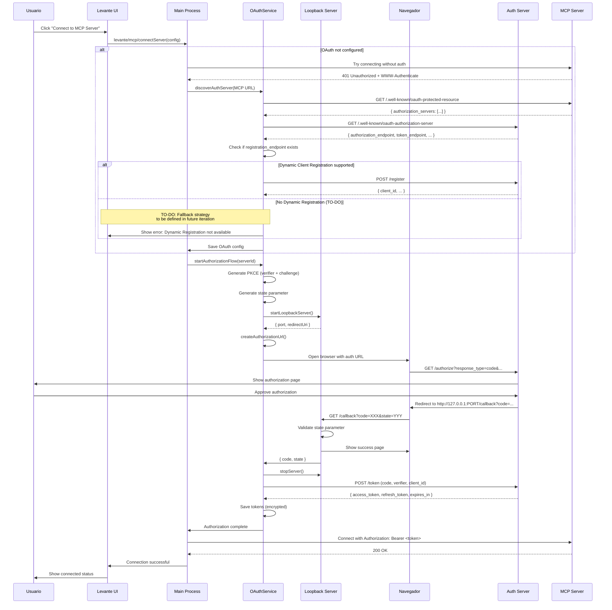
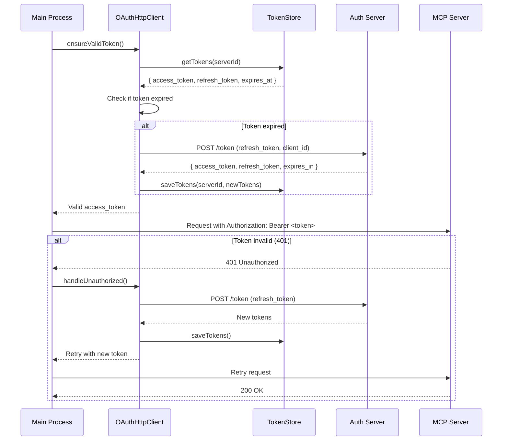

# Plan de Implementación OAuth para Levante

## Información del Documento

- **Versión**: 1.1
- **Fecha**: 2025-12-21
- **Estado**: Propuesta (Actualizada)
- **Autor**: Arquitectura Levante

## Tabla de Contenidos

1. [Resumen Ejecutivo](#resumen-ejecutivo)
2. [Contexto y Arquitectura Actual](#contexto-y-arquitectura-actual)
3. [Decisiones de Diseño](#decisiones-de-diseño)
4. [Arquitectura OAuth Propuesta](#arquitectura-oauth-propuesta)
5. [Plan de Implementación por Fases](#plan-de-implementación-por-fases)
6. [Detalles Técnicos por Fase](#detalles-técnicos-por-fase)
7. [Diagrama de Secuencias](#diagrama-de-secuencias)
8. [Consideraciones de Seguridad](#consideraciones-de-seguridad)
9. [Plan de Testing](#plan-de-testing)
10. [Migración y Retrocompatibilidad](#migración-y-retrocompatibilidad)

---

## Resumen Ejecutivo

Este documento define el plan de implementación para incorporar autenticación OAuth 2.1 con PKCE a Levante, permitiendo conexiones seguras a servidores MCP protegidos. La implementación seguirá las especificaciones oficiales del protocolo MCP y las mejores prácticas de OAuth para aplicaciones nativas.

### Objetivos

1. Soportar autenticación OAuth para servidores MCP con transporte HTTP
2. Implementar flujo Authorization Code + PKCE (S256)
3. Almacenamiento seguro de tokens con rotación automática
4. Discovery automático de Authorization Servers (RFC 9728 + RFC 8414)
5. Soporte para Dynamic Client Registration (RFC 7591)
6. Revocación de tokens y gestión de sesiones

### Alcance

- **Incluye**: OAuth para transportes HTTP/SSE/Streamable-HTTP
- **Excluye**: OAuth para transporte STDIO (según especificación MCP)
- **Timeline Estimado**: 6 fases incrementales

---

## Contexto y Arquitectura Actual

### Arquitectura Levante

Levante es una aplicación Electron con arquitectura hexagonal que incluye:

```
┌─────────────────────────────────────────────────────────────┐
│                     Renderer Process                         │
│  ┌──────────────┐  ┌──────────────┐  ┌──────────────┐      │
│  │  React UI    │  │ Zustand      │  │  window.     │      │
│  │  Components  │──│  Stores      │──│  levante.mcp │      │
│  └──────────────┘  └──────────────┘  └──────────────┘      │
└─────────────────────────────────────────────────────────────┘
                            │ IPC (levante/*)
┌─────────────────────────────────────────────────────────────┐
│                      Main Process                            │
│  ┌──────────────┐  ┌──────────────┐  ┌──────────────┐      │
│  │ MCP Service  │  │  Transports  │  │ Preferences  │      │
│  │   Factory    │──│   Manager    │  │   Service    │      │
│  └──────────────┘  └──────────────┘  └──────────────┘      │
│         │                                      │             │
│  ┌──────────────┐                    ┌──────────────┐      │
│  │ MCPUseService│                    │ electron-    │      │
│  │ (default)    │                    │ store        │      │
│  └──────────────┘                    │ (encrypted)  │      │
│                                       └──────────────┘      │
└─────────────────────────────────────────────────────────────┘
                            │
                    ┌───────────────┐
                    │  MCP Servers  │
                    │ (stdio/http)  │
                    └───────────────┘
```

### Sistema MCP Actual

**Características:**
- Soporta 4 transportes: `stdio`, `http`, `sse`, `streamable-http`
- Dos implementaciones: MCPUseService (default) y MCPLegacyService
- Sin autenticación OAuth actualmente
- Headers estáticos soportados (`config.headers`)

**Almacenamiento Actual:**
- `~/levante/ui-preferences.json` - Configuración de servidores MCP
- Encriptación selectiva con `safeStorage` de Electron
- Servicio: `PreferencesService`

---

## Decisiones de Diseño

### 1. Estrategia de OAuth

**Decisión**: Authorization Code Flow + PKCE (S256)

**Justificación**:
- Recomendación estándar para aplicaciones nativas (RFC 8252)
- PKCE obligatorio en OAuth 2.1
- Protección contra ataques de intercepción de código
- Compatible con clientes públicos (sin client_secret)

### 2. Método de Redirect

**Decisión**: Loopback HTTP (127.0.0.1 con puerto aleatorio)

**Justificación**:
- Más seguro que custom protocol (`levante://`)
- Evita riesgos de "app impersonation"
- Recomendación RFC 8252 para native apps
- Fácil de implementar en Electron

**Alternativa considerada**: Custom protocol `levante://oauth/callback`
- Descartada por menor seguridad en algunos OS
- Mayor complejidad en registro del protocol handler

### 3. Almacenamiento de Tokens

**Decisión**: Extensión del sistema actual de PreferencesService

**Estructura propuesta**:
```json
{
  "mcpServers": {
    "server-id": {
      "transport": "http",
      "baseUrl": "https://mcp.example.com",
      "oauth": {
        "enabled": true,
        "authServerId": "https://auth.example.com",
        "clientId": "levante-client-abc123",
        "scopes": ["mcp:read", "mcp:write"],
        "accessToken": "ENCRYPTED:...",
        "refreshToken": "ENCRYPTED:...",
        "expiresAt": 1703980800000,
        "tokenType": "Bearer"
      }
    }
  }
}
```

**Encriptación**:
- Solo campos sensibles: `accessToken`, `refreshToken`, `clientSecret` (si existe)
- Usa `electron.safeStorage` (Keychain/DPAPI/libsecret)
- Prefix `ENCRYPTED:` para valores encriptados

### 4. Discovery de Authorization Server

**Decisión**: Implementación completa de RFC 9728 + RFC 8414

**Flujo**:
1. Request MCP sin token → `401 Unauthorized`
2. Header `WWW-Authenticate` indica URL de metadata
3. Fetch `/.well-known/oauth-protected-resource` (RFC 9728)
4. Extraer `authorization_servers` array
5. Fetch `/.well-known/oauth-authorization-server` (RFC 8414)
6. Obtener endpoints: `authorization_endpoint`, `token_endpoint`, etc.

### 5. Dynamic Client Registration

**Decisión**: Dynamic Client Registration (RFC 7591) como método principal

**Estrategia**:
1. Intentar Dynamic Client Registration (RFC 7591) si el Authorization Server lo soporta
2. ⚠️ **TO-DO: Fallback cuando Dynamic Registration falla**
   - **Pendiente de definir**: Estrategia de obtención de `client_id` cuando no hay Dynamic Registration
   - **Opciones a evaluar**:
     - Client IDs embebidos en Levante para proveedores conocidos
     - Client ID proporcionado en la configuración del servidor MCP
     - Combinación de ambas estrategias
   - **NO se solicitará `client_id` al usuario final** - el usuario de Levante no administra servidores OAuth
   - Esta decisión se definirá en una iteración posterior del plan

**Nota**: Por ahora, la implementación se centrará en Dynamic Client Registration. El flujo alternativo se diseñará cuando se evalúen casos de uso reales.

### 6. Ámbito de Implementación

**Solo para transportes HTTP**:
- `http`, `sse`, `streamable-http` → OAuth
- `stdio` → NO OAuth (credenciales de entorno)

**Compatibilidad**:
- Servidores sin OAuth → funcionan como antes
- Servidores con OAuth → flujo automático

---

## Arquitectura OAuth Propuesta

### Nuevos Componentes

```
┌─────────────────────────────────────────────────────────────┐
│                    NUEVOS COMPONENTES                        │
└─────────────────────────────────────────────────────────────┘

1. OAuthService (Main Process)
   ├── OAuthFlowManager
   │   ├── generatePKCE()
   │   ├── createAuthorizationUrl()
   │   ├── exchangeCodeForTokens()
   │   └── refreshAccessToken()
   ├── OAuthTokenStore
   │   ├── saveTokens()
   │   ├── getTokens()
   │   ├── refreshTokens()
   │   └── revokeTokens()
   └── OAuthDiscoveryService
       ├── discoverAuthServer() // RFC 9728
       ├── fetchServerMetadata() // RFC 8414
       └── registerClient()      // RFC 7591 (opcional)

2. OAuthRedirectServer (Main Process)
   ├── startLoopbackServer()
   ├── handleCallback()
   └── stopServer()

3. OAuthHttpClient (Transport Layer)
   ├── addAuthorizationHeader()
   ├── handleUnauthorized()
   └── retryWithRefresh()

4. UI Components (Renderer)
   ├── OAuthConnectionDialog
   ├── OAuthPermissionsView
   └── OAuthStatusIndicator
```

### Integración con Sistema Actual

```typescript
// Extensión de MCPServerConfig
interface MCPServerConfig {
  // ... campos existentes ...
  oauth?: {
    enabled: boolean;
    authServerId?: string;
    clientId?: string;
    scopes?: string[];
    // tokens almacenados en PreferencesService (encriptados)
  };
}

// Extensión de transports.ts
async function createTransport(config: MCPServerConfig) {
  if (config.oauth?.enabled && isHttpTransport(config.transport)) {
    // 1. Check if token exists and is valid
    const tokens = await oauthTokenStore.getTokens(config.id);

    if (!tokens || isExpired(tokens)) {
      // 2. Trigger OAuth flow
      await oauthService.authorize(config);
    }

    // 3. Create transport with authorization header
    return createAuthenticatedTransport(config, tokens);
  }

  // Flujo normal para servidores sin OAuth
  return createNormalTransport(config);
}
```

---

## Plan de Implementación por Fases

### Fase 0: Preparación y Fundamentos (1 semana)

**Objetivos**:
- Setup de infraestructura base
- Validación de dependencias
- Documentación de interfaces

**Entregables**:
- [ ] Tipos TypeScript para OAuth
- [ ] Documentación de arquitectura
- [ ] Setup de environment para testing
- [ ] Decisión final sobre librería OAuth (custom vs `oauth4webapi`)

### Fase 1: Token Store Seguro (1-2 semanas)

**Objetivos**:
- Implementar almacenamiento seguro de tokens OAuth
- Extender PreferencesService para manejar tokens encriptados
- CRUD operations para tokens por servidor MCP

**Componentes**:
```typescript
// src/main/services/oauth/OAuthTokenStore.ts
class OAuthTokenStore {
  async saveTokens(serverId: string, tokens: OAuthTokens): Promise<void>
  async getTokens(serverId: string): Promise<OAuthTokens | null>
  async deleteTokens(serverId: string): Promise<void>
  async refreshTokens(serverId: string): Promise<OAuthTokens>
  isTokenExpired(tokens: OAuthTokens): boolean
}

interface OAuthTokens {
  accessToken: string;
  refreshToken?: string;
  expiresAt: number;
  tokenType: 'Bearer';
  scope?: string;
}
```

**Testing**:
- Unit tests para encriptación/desencriptación
- Tests de persistencia
- Tests de expiración

### Fase 2: OAuth Flow con PKCE (2-3 semanas)

**Objetivos**:
- Implementar Authorization Code Flow completo
- PKCE S256 generation
- Loopback redirect server
- Intercambio de código por tokens

**Componentes**:
```typescript
// src/main/services/oauth/OAuthFlowManager.ts
class OAuthFlowManager {
  // PKCE
  generatePKCE(): { verifier: string; challenge: string }

  // Authorization URL
  createAuthorizationUrl(params: {
    authEndpoint: string;
    clientId: string;
    redirectUri: string;
    scopes: string[];
    state: string;
    codeChallenge: string;
  }): string

  // Token exchange
  exchangeCodeForTokens(params: {
    tokenEndpoint: string;
    code: string;
    redirectUri: string;
    clientId: string;
    codeVerifier: string;
  }): Promise<OAuthTokens>

  // Refresh
  refreshAccessToken(params: {
    tokenEndpoint: string;
    refreshToken: string;
    clientId: string;
  }): Promise<OAuthTokens>
}

// src/main/services/oauth/OAuthRedirectServer.ts
class OAuthRedirectServer {
  async start(): Promise<{ port: number; url: string }>
  async waitForCallback(): Promise<{ code: string; state: string }>
  async stop(): Promise<void>
}
```

**Testing**:
- Mock de Authorization Server
- Tests de PKCE generation
- Tests de redirect server
- Tests de token exchange

### Fase 3: Discovery Automático (1-2 semanas)

**Objetivos**:
- RFC 9728: Protected Resource Metadata
- RFC 8414: Authorization Server Metadata
- Parseo de `WWW-Authenticate` header
- Cache de metadata

**Componentes**:
```typescript
// src/main/services/oauth/OAuthDiscoveryService.ts
class OAuthDiscoveryService {
  // RFC 9728: Protected Resource Metadata
  async discoverAuthServer(resourceUrl: string): Promise<{
    authorizationServers: string[];
    resource: string;
  }>

  // RFC 8414: Authorization Server Metadata
  async fetchServerMetadata(authServerUrl: string): Promise<{
    authorizationEndpoint: string;
    tokenEndpoint: string;
    revocationEndpoint?: string;
    registrationEndpoint?: string;
    scopesSupported?: string[];
    responseTypesSupported: string[];
    codeChallengeMethodsSupported: string[];
  }>

  // Parse WWW-Authenticate header
  parseWWWAuthenticate(header: string): {
    resourceMetadataUrl?: string;
  }
}
```

**Testing**:
- Mock servers con metadata
- Tests de parseo de headers
- Tests de validación de metadata
- Tests de cache

### Fase 4: HTTP Client con Auto-Refresh (1-2 semanas)

**Objetivos**:
- Interceptor para añadir Authorization header
- Detección de `401 Unauthorized`
- Auto-refresh de tokens
- Retry automático tras refresh

**Integración**:
```typescript
// Modificación de transports.ts
import { OAuthHttpClient } from './oauth/OAuthHttpClient';

async function createTransport(config: MCPServerConfig) {
  const transportType = config.transport;
  const baseUrl = config.baseUrl;

  // Check if OAuth is enabled
  if (config.oauth?.enabled && isHttpTransport(transportType)) {
    return createOAuthTransport(config, transportType, baseUrl);
  }

  return createNormalTransport(config, transportType, baseUrl);
}

async function createOAuthTransport(
  config: MCPServerConfig,
  transportType: string,
  baseUrl: string
) {
  const oauthClient = new OAuthHttpClient(config.id);

  // Get or refresh token
  const token = await oauthClient.ensureValidToken();

  // Add Authorization header
  const headers = {
    ...config.headers,
    Authorization: `Bearer ${token.accessToken}`,
  };

  // Create transport with auth headers
  switch (transportType) {
    case 'http':
      return new StreamableHTTPClientTransport(new URL(baseUrl), {
        requestInit: { headers },
      });
    case 'sse':
      return new SSEClientTransport(new URL(baseUrl), {
        requestInit: { headers },
      });
    // ... otros casos
  }
}
```

**Testing**:
- Mock de 401 responses
- Tests de refresh flow
- Tests de retry logic
- Tests de error handling

### Fase 5: Dynamic Client Registration (1 semana)

**Objetivos**:
- RFC 7591: Dynamic Client Registration Protocol
- Manejo de errores cuando no hay Dynamic Registration disponible

**Componentes**:
```typescript
// Extensión de OAuthDiscoveryService
class OAuthDiscoveryService {
  // ... métodos existentes ...

  async registerClient(params: {
    registrationEndpoint: string;
    clientName: string;
    redirectUris: string[];
  }): Promise<{
    clientId: string;
    clientSecret?: string; // Solo para confidential clients
  }>
}
```

**Flujo de Implementación**:
1. Usuario intenta conectar a servidor MCP con OAuth
2. Discovery detecta `registration_endpoint`
3. Intentar Dynamic Client Registration automáticamente
4. ⚠️ **TO-DO: Si falla Dynamic Registration**:
   - Mostrar error informativo al usuario
   - Detallar en el error que el servidor requiere configuración adicional
   - El flujo específico de fallback se definirá posteriormente
   - Opciones bajo consideración:
     - Verificar si existe client_id embebido para este proveedor
     - Verificar si el config del servidor MCP incluye client_id
     - Mostrar mensaje claro sobre qué hacer

**Testing**:
- Mock de registration endpoint
- Tests de registration flow exitoso
- Tests de error handling cuando no hay registration endpoint
- Tests de validación de respuesta del servidor

**Nota**: Esta fase se centrará en el flujo exitoso de Dynamic Registration. El manejo de casos donde no está disponible se implementará en una fase posterior una vez definida la estrategia de fallback.

### Fase 6: Revocación, Disconnect y UI Final (1-2 semanas)

**Objetivos**:
- RFC 7009: Token Revocation
- UI completa para OAuth connections
- Estado de conexiones OAuth
- Disconnect con revocación

**Componentes**:
```typescript
// Extensión de OAuthFlowManager
class OAuthFlowManager {
  // ... métodos existentes ...

  async revokeToken(params: {
    revocationEndpoint: string;
    token: string;
    tokenTypeHint: 'access_token' | 'refresh_token';
    clientId: string;
  }): Promise<void>
}
```

**UI Components**:

1. **OAuthConnectionDialog**
   - Shows authorization flow progress
   - Displays requested scopes
   - Explains what the server can access

2. **OAuthPermissionsView**
   - List of granted permissions
   - Connection status
   - Last token refresh
   - Disconnect button

3. **OAuthStatusIndicator**
   - Visual indicator in server list
   - OAuth vs non-OAuth servers
   - Token expiration warnings

**IPC Additions**:
```typescript
// New IPC channels
ipcMain.handle('levante/oauth/authorize', async (event, serverId) => {
  // Trigger OAuth flow
});

ipcMain.handle('levante/oauth/disconnect', async (event, serverId) => {
  // Revoke tokens and disconnect
});

ipcMain.handle('levante/oauth/status', async (event, serverId) => {
  // Get OAuth connection status
});
```

**Testing**:
- Integration tests de flujo completo
- Tests de revocation
- E2E tests con UI
- Manual testing con servidor OAuth real

---

## Detalles Técnicos por Fase

### Fase 1: Token Store - Detalles

**Estructura de Almacenamiento**:

```typescript
// Extension to ui-preferences.json
interface UIPreferences {
  // ... existing fields ...
  mcpServers: {
    [serverId: string]: {
      // ... existing MCP config fields ...
      oauth?: {
        enabled: boolean;
        authServerId: string;
        clientId: string;
        clientSecret?: string; // ENCRYPTED if exists
        scopes: string[];
        redirectUri: string;
        // Tokens stored separately for security
      };
    };
  };

  // New section for OAuth tokens (all encrypted)
  oauthTokens: {
    [serverId: string]: {
      accessToken: string;      // ENCRYPTED
      refreshToken?: string;    // ENCRYPTED
      expiresAt: number;
      tokenType: 'Bearer';
      scope?: string;
      issuedAt: number;
    };
  };
}
```

**Encriptación**:
```typescript
import { safeStorage } from 'electron';

class OAuthTokenStore {
  private preferencesService: PreferencesService;

  private encrypt(value: string): string {
    const encrypted = safeStorage.encryptString(value);
    return `ENCRYPTED:${encrypted.toString('base64')}`;
  }

  private decrypt(encrypted: string): string {
    if (!encrypted.startsWith('ENCRYPTED:')) {
      throw new Error('Invalid encrypted format');
    }

    const data = encrypted.replace('ENCRYPTED:', '');
    const buffer = Buffer.from(data, 'base64');
    return safeStorage.decryptString(buffer);
  }

  async saveTokens(serverId: string, tokens: OAuthTokens): Promise<void> {
    const encrypted = {
      accessToken: this.encrypt(tokens.accessToken),
      refreshToken: tokens.refreshToken
        ? this.encrypt(tokens.refreshToken)
        : undefined,
      expiresAt: tokens.expiresAt,
      tokenType: tokens.tokenType,
      scope: tokens.scope,
      issuedAt: Date.now(),
    };

    await this.preferencesService.set(`oauthTokens.${serverId}`, encrypted);
  }

  async getTokens(serverId: string): Promise<OAuthTokens | null> {
    const encrypted = await this.preferencesService.get(
      `oauthTokens.${serverId}`
    );

    if (!encrypted) return null;

    return {
      accessToken: this.decrypt(encrypted.accessToken),
      refreshToken: encrypted.refreshToken
        ? this.decrypt(encrypted.refreshToken)
        : undefined,
      expiresAt: encrypted.expiresAt,
      tokenType: encrypted.tokenType,
      scope: encrypted.scope,
    };
  }

  isTokenExpired(tokens: OAuthTokens): boolean {
    // Add 60 second buffer for clock skew
    return Date.now() >= (tokens.expiresAt - 60000);
  }
}
```

### Fase 2: OAuth Flow - Detalles

**PKCE Implementation**:
```typescript
import * as crypto from 'crypto';

class OAuthFlowManager {
  generatePKCE(): { verifier: string; challenge: string } {
    // Generate code verifier (43-128 characters)
    const verifier = crypto
      .randomBytes(32)
      .toString('base64url'); // RFC 4648 base64url encoding

    // Generate code challenge (S256)
    const challenge = crypto
      .createHash('sha256')
      .update(verifier)
      .digest('base64url');

    return { verifier, challenge };
  }

  createAuthorizationUrl(params: {
    authEndpoint: string;
    clientId: string;
    redirectUri: string;
    scopes: string[];
    state: string;
    codeChallenge: string;
  }): string {
    const url = new URL(params.authEndpoint);

    url.searchParams.set('response_type', 'code');
    url.searchParams.set('client_id', params.clientId);
    url.searchParams.set('redirect_uri', params.redirectUri);
    url.searchParams.set('scope', params.scopes.join(' '));
    url.searchParams.set('state', params.state);
    url.searchParams.set('code_challenge', params.codeChallenge);
    url.searchParams.set('code_challenge_method', 'S256');

    return url.toString();
  }

  async exchangeCodeForTokens(params: {
    tokenEndpoint: string;
    code: string;
    redirectUri: string;
    clientId: string;
    codeVerifier: string;
  }): Promise<OAuthTokens> {
    const body = new URLSearchParams({
      grant_type: 'authorization_code',
      code: params.code,
      redirect_uri: params.redirectUri,
      client_id: params.clientId,
      code_verifier: params.codeVerifier,
    });

    const response = await fetch(params.tokenEndpoint, {
      method: 'POST',
      headers: {
        'Content-Type': 'application/x-www-form-urlencoded',
      },
      body: body.toString(),
    });

    if (!response.ok) {
      const error = await response.json();
      throw new Error(`Token exchange failed: ${error.error_description || error.error}`);
    }

    const data = await response.json();

    return {
      accessToken: data.access_token,
      refreshToken: data.refresh_token,
      expiresAt: Date.now() + (data.expires_in * 1000),
      tokenType: data.token_type,
      scope: data.scope,
    };
  }
}
```

**Loopback Redirect Server**:
```typescript
import * as http from 'http';
import * as net from 'net';

class OAuthRedirectServer {
  private server?: http.Server;
  private port?: number;
  private callbackPromise?: Promise<{ code: string; state: string }>;
  private resolveCallback?: (value: any) => void;
  private rejectCallback?: (error: any) => void;

  async start(): Promise<{ port: number; url: string }> {
    // Find available port
    this.port = await this.findAvailablePort();

    // Create callback promise
    this.callbackPromise = new Promise((resolve, reject) => {
      this.resolveCallback = resolve;
      this.rejectCallback = reject;

      // Timeout after 5 minutes
      setTimeout(() => {
        reject(new Error('OAuth callback timeout'));
      }, 5 * 60 * 1000);
    });

    // Start HTTP server
    this.server = http.createServer((req, res) => {
      this.handleRequest(req, res);
    });

    await new Promise<void>((resolve) => {
      this.server!.listen(this.port, '127.0.0.1', () => {
        resolve();
      });
    });

    const url = `http://127.0.0.1:${this.port}/callback`;
    return { port: this.port, url };
  }

  private async findAvailablePort(): Promise<number> {
    return new Promise((resolve, reject) => {
      const server = net.createServer();

      server.listen(0, '127.0.0.1', () => {
        const port = (server.address() as net.AddressInfo).port;
        server.close(() => resolve(port));
      });

      server.on('error', reject);
    });
  }

  private handleRequest(req: http.IncomingMessage, res: http.ServerResponse) {
    const url = new URL(req.url!, `http://127.0.0.1:${this.port}`);

    if (url.pathname !== '/callback') {
      res.writeHead(404);
      res.end('Not Found');
      return;
    }

    const code = url.searchParams.get('code');
    const state = url.searchParams.get('state');
    const error = url.searchParams.get('error');

    if (error) {
      res.writeHead(200, { 'Content-Type': 'text/html' });
      res.end(`
        <html>
          <body>
            <h1>Authorization Failed</h1>
            <p>Error: ${error}</p>
            <p>You can close this window.</p>
          </body>
        </html>
      `);

      this.rejectCallback?.(new Error(`OAuth error: ${error}`));
      return;
    }

    if (!code || !state) {
      res.writeHead(400);
      res.end('Missing code or state parameter');
      this.rejectCallback?.(new Error('Missing code or state'));
      return;
    }

    // Success response
    res.writeHead(200, { 'Content-Type': 'text/html' });
    res.end(`
      <html>
        <body>
          <h1>Authorization Successful</h1>
          <p>You can close this window and return to Levante.</p>
        </body>
      </html>
    `);

    this.resolveCallback?.({ code, state });
  }

  async waitForCallback(): Promise<{ code: string; state: string }> {
    if (!this.callbackPromise) {
      throw new Error('Server not started');
    }
    return this.callbackPromise;
  }

  async stop(): Promise<void> {
    if (this.server) {
      await new Promise<void>((resolve) => {
        this.server!.close(() => resolve());
      });
      this.server = undefined;
    }
  }
}
```

### Fase 3: Discovery - Detalles

**RFC 9728 Implementation**:
```typescript
class OAuthDiscoveryService {
  private logger = getLogger();
  private metadataCache = new Map<string, any>();

  async discoverAuthServer(resourceUrl: string): Promise<{
    authorizationServers: string[];
    resource: string;
  }> {
    // RFC 9728: Protected Resource Metadata
    const metadataUrl = new URL(resourceUrl);
    metadataUrl.pathname = '/.well-known/oauth-protected-resource';

    this.logger.mcp.info('Fetching protected resource metadata', {
      url: metadataUrl.toString(),
    });

    const response = await fetch(metadataUrl.toString());

    if (!response.ok) {
      throw new Error(
        `Failed to fetch protected resource metadata: ${response.status}`
      );
    }

    const metadata = await response.json();

    // Validate required fields
    if (!metadata.resource) {
      throw new Error('Protected resource metadata missing "resource" field');
    }

    if (!metadata.authorization_servers ||
        !Array.isArray(metadata.authorization_servers)) {
      throw new Error(
        'Protected resource metadata missing or invalid "authorization_servers"'
      );
    }

    // Validate that resource matches the actual resource URL
    // RFC 9728 Section 7.6: Security consideration
    const resourceUri = new URL(metadata.resource);
    const actualUri = new URL(resourceUrl);

    if (resourceUri.origin !== actualUri.origin) {
      throw new Error(
        'Resource URI in metadata does not match actual resource origin'
      );
    }

    return {
      authorizationServers: metadata.authorization_servers,
      resource: metadata.resource,
    };
  }

  async fetchServerMetadata(authServerUrl: string): Promise<{
    authorizationEndpoint: string;
    tokenEndpoint: string;
    revocationEndpoint?: string;
    registrationEndpoint?: string;
    scopesSupported?: string[];
    responseTypesSupported: string[];
    codeChallengeMethodsSupported: string[];
  }> {
    // Check cache first
    if (this.metadataCache.has(authServerUrl)) {
      return this.metadataCache.get(authServerUrl);
    }

    // RFC 8414: Authorization Server Metadata
    const metadataUrl = new URL(authServerUrl);
    metadataUrl.pathname = '/.well-known/oauth-authorization-server';

    this.logger.mcp.info('Fetching authorization server metadata', {
      url: metadataUrl.toString(),
    });

    const response = await fetch(metadataUrl.toString());

    if (!response.ok) {
      throw new Error(
        `Failed to fetch authorization server metadata: ${response.status}`
      );
    }

    const metadata = await response.json();

    // Validate required fields
    const requiredFields = [
      'issuer',
      'authorization_endpoint',
      'token_endpoint',
      'response_types_supported',
    ];

    for (const field of requiredFields) {
      if (!metadata[field]) {
        throw new Error(
          `Authorization server metadata missing required field: ${field}`
        );
      }
    }

    // Validate PKCE support
    if (!metadata.code_challenge_methods_supported?.includes('S256')) {
      throw new Error(
        'Authorization server does not support PKCE with S256'
      );
    }

    const result = {
      authorizationEndpoint: metadata.authorization_endpoint,
      tokenEndpoint: metadata.token_endpoint,
      revocationEndpoint: metadata.revocation_endpoint,
      registrationEndpoint: metadata.registration_endpoint,
      scopesSupported: metadata.scopes_supported,
      responseTypesSupported: metadata.response_types_supported,
      codeChallengeMethodsSupported: metadata.code_challenge_methods_supported,
    };

    // Cache for 1 hour
    this.metadataCache.set(authServerUrl, result);
    setTimeout(() => {
      this.metadataCache.delete(authServerUrl);
    }, 60 * 60 * 1000);

    return result;
  }

  parseWWWAuthenticate(header: string): {
    resourceMetadataUrl?: string;
  } {
    // Example header:
    // WWW-Authenticate: Bearer realm="mcp", as_uri="https://auth.example.com",
    //                   resource_metadata="https://mcp.example.com/.well-known/oauth-protected-resource"

    const params: Record<string, string> = {};

    // Parse Bearer challenge parameters
    const paramsMatch = header.match(/Bearer\s+(.+)/i);
    if (!paramsMatch) {
      return {};
    }

    const paramString = paramsMatch[1];
    const paramRegex = /(\w+)="([^"]+)"/g;
    let match;

    while ((match = paramRegex.exec(paramString)) !== null) {
      params[match[1]] = match[2];
    }

    return {
      resourceMetadataUrl: params.resource_metadata,
    };
  }
}
```

### Fase 4: HTTP Client - Detalles

**OAuth HTTP Interceptor**:
```typescript
class OAuthHttpClient {
  private serverId: string;
  private tokenStore: OAuthTokenStore;
  private flowManager: OAuthFlowManager;
  private logger = getLogger();

  constructor(serverId: string) {
    this.serverId = serverId;
    this.tokenStore = new OAuthTokenStore();
    this.flowManager = new OAuthFlowManager();
  }

  async ensureValidToken(): Promise<OAuthTokens> {
    let tokens = await this.tokenStore.getTokens(this.serverId);

    if (!tokens) {
      throw new Error('No OAuth tokens found. Please authorize first.');
    }

    // Check if token is expired
    if (this.tokenStore.isTokenExpired(tokens)) {
      this.logger.mcp.info('Access token expired, refreshing', {
        serverId: this.serverId,
      });

      // Refresh token
      tokens = await this.refreshToken(tokens);
    }

    return tokens;
  }

  private async refreshToken(oldTokens: OAuthTokens): Promise<OAuthTokens> {
    if (!oldTokens.refreshToken) {
      throw new Error('No refresh token available. Re-authorization required.');
    }

    try {
      // Get server OAuth config
      const oauthConfig = await this.getOAuthConfig();

      // Get auth server metadata
      const discovery = new OAuthDiscoveryService();
      const metadata = await discovery.fetchServerMetadata(
        oauthConfig.authServerId
      );

      // Refresh tokens
      const newTokens = await this.flowManager.refreshAccessToken({
        tokenEndpoint: metadata.tokenEndpoint,
        refreshToken: oldTokens.refreshToken,
        clientId: oauthConfig.clientId,
      });

      // Save new tokens
      await this.tokenStore.saveTokens(this.serverId, newTokens);

      this.logger.mcp.info('Successfully refreshed access token', {
        serverId: this.serverId,
      });

      return newTokens;
    } catch (error) {
      this.logger.mcp.error('Failed to refresh token', {
        serverId: this.serverId,
        error: error instanceof Error ? error.message : error,
      });

      // Delete invalid tokens
      await this.tokenStore.deleteTokens(this.serverId);

      throw new Error(
        'Token refresh failed. Re-authorization required.'
      );
    }
  }

  private async getOAuthConfig() {
    const prefs = new PreferencesService();
    await prefs.initialize();
    const config = await prefs.get(`mcpServers.${this.serverId}.oauth`);

    if (!config) {
      throw new Error('OAuth configuration not found');
    }

    return config;
  }

  async handleUnauthorized(response: Response): Promise<boolean> {
    // Parse WWW-Authenticate header for additional info
    const wwwAuth = response.headers.get('WWW-Authenticate');

    if (wwwAuth) {
      this.logger.mcp.warn('Received 401 with WWW-Authenticate', {
        serverId: this.serverId,
        header: wwwAuth,
      });
    }

    // Try to refresh token
    try {
      const tokens = await this.tokenStore.getTokens(this.serverId);

      if (tokens?.refreshToken) {
        await this.refreshToken(tokens);
        return true; // Retry request
      }
    } catch (error) {
      this.logger.mcp.error('Failed to handle 401', {
        serverId: this.serverId,
        error: error instanceof Error ? error.message : error,
      });
    }

    return false; // Cannot retry
  }
}
```

**Integration with MCP Transports**:
```typescript
// Modificar transports.ts para soportar OAuth

export async function createTransport(
  config: MCPServerConfig
): Promise<{ client: Client; transport: any }> {
  const transportType = config.transport || (config as any).type;
  const baseUrl = config.baseUrl || (config as any).url;

  // Check if OAuth is required
  if (config.oauth?.enabled && isHttpTransport(transportType)) {
    return await createOAuthTransport(config, transportType, baseUrl);
  }

  // Standard transport (existing logic)
  return await createStandardTransport(config, transportType, baseUrl);
}

async function createOAuthTransport(
  config: MCPServerConfig,
  transportType: string,
  baseUrl: string
): Promise<{ client: Client; transport: any }> {
  const oauthClient = new OAuthHttpClient(config.id);

  try {
    // Ensure we have a valid token
    const tokens = await oauthClient.ensureValidToken();

    // Create headers with Authorization
    const headers = {
      ...config.headers,
      Authorization: `Bearer ${tokens.accessToken}`,
    };

    // Create client
    const client = new Client(
      { name: 'Levante-MCP-Client', version: '1.0.0' },
      { capabilities: { sampling: {}, roots: { listChanged: true } } }
    );

    // Create transport with OAuth headers
    let transport;

    switch (transportType) {
      case 'http':
      case 'streamable-http':
        transport = new StreamableHTTPClientTransport(new URL(baseUrl), {
          requestInit: { headers },
        });
        break;

      case 'sse':
        transport = new SSEClientTransport(new URL(baseUrl), {
          requestInit: { headers },
        });
        break;

      default:
        throw new Error(`Unsupported transport for OAuth: ${transportType}`);
    }

    return { client, transport };
  } catch (error) {
    logger.mcp.error('Failed to create OAuth transport', {
      serverId: config.id,
      error: error instanceof Error ? error.message : error,
    });
    throw error;
  }
}

function isHttpTransport(transport: string): boolean {
  return ['http', 'sse', 'streamable-http'].includes(transport);
}
```

---

## Diagrama de Secuencias

### Flujo Completo de Autorización OAuth



### Flujo de Refresh de Token



---

## Consideraciones de Seguridad

### 1. Almacenamiento de Tokens

**Amenaza**: Robo de tokens del sistema de archivos

**Mitigación**:
- ✅ Encriptación con `electron.safeStorage` (Keychain/DPAPI/libsecret)
- ✅ Solo tokens encriptados en disco
- ✅ Tokens nunca en logs
- ✅ Tokens nunca en variables de entorno
- ✅ Separación de tokens de configuración

**Código Seguro**:
```typescript
// ❌ MAL - Token en plaintext
await fs.writeFile('tokens.json', JSON.stringify({ token: accessToken }));

// ✅ BIEN - Token encriptado
const encrypted = safeStorage.encryptString(accessToken);
await preferences.set('token', `ENCRYPTED:${encrypted.toString('base64')}`);
```

### 2. PKCE Obligatorio

**Amenaza**: Intercepción de authorization code

**Mitigación**:
- ✅ PKCE S256 siempre habilitado
- ✅ Validación de `code_verifier` en token exchange
- ✅ Generar `code_verifier` con `crypto.randomBytes(32)`
- ✅ Nunca reusar `code_verifier`

**Validación**:
```typescript
// Verificar que AS soporta PKCE S256
const metadata = await fetchServerMetadata(authServerUrl);

if (!metadata.codeChallengeMethodsSupported?.includes('S256')) {
  throw new SecurityError('Authorization server does not support PKCE S256');
}
```

### 3. State Parameter

**Amenaza**: CSRF attacks en OAuth flow

**Mitigación**:
- ✅ Generar `state` aleatorio (min 128 bits)
- ✅ Validar `state` en callback
- ✅ State único por sesión
- ✅ Timeout de state (5 minutos)

**Implementación**:
```typescript
// Generar state
const state = crypto.randomBytes(16).toString('hex'); // 128 bits
const stateExpiry = Date.now() + (5 * 60 * 1000); // 5 minutos

// Almacenar temporalmente
pendingStates.set(state, { expiry: stateExpiry, serverId });

// Validar en callback
const stored = pendingStates.get(receivedState);
if (!stored || stored.expiry < Date.now()) {
  throw new SecurityError('Invalid or expired state parameter');
}
pendingStates.delete(receivedState);
```

### 4. Redirect URI Validation

**Amenaza**: Open redirect attacks

**Mitigación**:
- ✅ Solo loopback (127.0.0.1)
- ✅ Puerto aleatorio por sesión
- ✅ Validación exacta de redirect_uri
- ✅ No permitir http (excepto loopback)

**Validación**:
```typescript
function validateRedirectUri(uri: string): boolean {
  const url = new URL(uri);

  // Solo loopback
  if (url.hostname !== '127.0.0.1') {
    return false;
  }

  // Solo HTTP para loopback
  if (url.protocol !== 'http:') {
    return false;
  }

  // Path debe ser /callback
  if (url.pathname !== '/callback') {
    return false;
  }

  return true;
}
```

### 5. Token Audience Validation

**Amenaza**: Token passthrough / confused deputy

**Mitigación**:
- ✅ Implementar RFC 8707 (Resource Indicators)
- ✅ Incluir `resource` parameter en authorization request
- ✅ Validar que token fue emitido para el MCP server específico
- ✅ NO pasar tokens a otros servicios

**Implementación**:
```typescript
// Authorization request con resource parameter
const authUrl = createAuthorizationUrl({
  // ... otros params ...
  resource: config.baseUrl, // RFC 8707
});

// Validación en MCP server (conceptual - del lado del servidor)
function validateToken(token: string, expectedAudience: string): boolean {
  const decoded = jwt.decode(token);

  // Validar audience claim
  if (decoded.aud !== expectedAudience) {
    throw new SecurityError('Token audience mismatch');
  }

  return true;
}
```

### 6. TLS/HTTPS Obligatorio

**Amenaza**: Man-in-the-middle attacks

**Mitigación**:
- ✅ HTTPS obligatorio para authorization_endpoint
- ✅ HTTPS obligatorio para token_endpoint
- ✅ HTTPS obligatorio para MCP servers (excepto localhost)
- ✅ Validar certificados TLS

**Validación**:
```typescript
function validateEndpointUrl(url: string, allowLoopback: boolean = false): void {
  const parsed = new URL(url);

  // Allow http only for loopback
  if (parsed.protocol === 'http:') {
    if (!allowLoopback || !['127.0.0.1', 'localhost'].includes(parsed.hostname)) {
      throw new SecurityError('HTTPS required for non-loopback endpoints');
    }
  }

  if (parsed.protocol !== 'https:' && parsed.protocol !== 'http:') {
    throw new SecurityError(`Unsupported protocol: ${parsed.protocol}`);
  }
}
```

### 7. Token Rotation

**Amenaza**: Robo de refresh tokens de larga duración

**Mitigación**:
- ✅ Soportar refresh token rotation (OAuth 2.1)
- ✅ Invalidar refresh token anterior tras rotación
- ✅ Access tokens de corta duración (recomendado < 1 hora)
- ✅ Almacenar última fecha de refresh

**Implementación**:
```typescript
async refreshAccessToken(oldRefreshToken: string): Promise<OAuthTokens> {
  const newTokens = await exchangeRefreshToken(oldRefreshToken);

  // Si el AS rota refresh tokens (OAuth 2.1)
  if (newTokens.refreshToken && newTokens.refreshToken !== oldRefreshToken) {
    logger.mcp.info('Refresh token rotated', { serverId });

    // Invalidar token anterior (si el AS no lo hizo automáticamente)
    // Nota: muchos AS invalidan automáticamente el refresh token anterior
  }

  // Guardar nuevos tokens
  await this.tokenStore.saveTokens(serverId, newTokens);

  return newTokens;
}
```

### 8. Secrets en Logs

**Amenaza**: Exposición de tokens/secrets en logs

**Mitigación**:
- ✅ Nunca loggear tokens completos
- ✅ Loggear solo los primeros 8 caracteres (para debugging)
- ✅ Sanitizar logs automáticamente
- ✅ Separate log levels (debug vs production)

**Safe Logging**:
```typescript
function sanitizeForLog(token: string): string {
  if (!token || token.length < 16) return '[REDACTED]';
  return `${token.substring(0, 8)}...[REDACTED]`;
}

// Uso
logger.mcp.debug('Token refreshed', {
  serverId,
  tokenPreview: sanitizeForLog(newToken.accessToken),
  expiresAt: newToken.expiresAt,
});
```

### 9. Browser Security

**Amenaza**: Phishing del authorization flow

**Mitigación**:
- ✅ Usar navegador del sistema (no webview embebido)
- ✅ Mostrar URL completa del authorization server
- ✅ Advertir si el authorization server no usa HTTPS
- ✅ Permitir al usuario cancelar en cualquier momento

**UI Safety**:
```typescript
async function openAuthorizationBrowser(authUrl: string): Promise<void> {
  const url = new URL(authUrl);

  // Mostrar dialog de confirmación
  const confirmed = await showAuthorizationDialog({
    message: 'Levante will open your browser to authorize this connection',
    authServer: url.origin,
    scopes: extractScopes(authUrl),
    warningIfHttp: url.protocol !== 'https:',
  });

  if (!confirmed) {
    throw new UserCancelledError();
  }

  // Abrir en navegador del sistema
  await shell.openExternal(authUrl);
}
```

### 10. Dynamic Client Registration

**Amenaza**: Registro de clientes maliciosos

**Mitigación**:
- ✅ Validar metadata del AS antes de registrar
- ✅ Usar `client_name: "Levante"` consistente
- ✅ Solo registrar `redirect_uri` loopback
- ✅ No solicitar scopes innecesarios

**Safe Registration**:
```typescript
async function registerClient(
  registrationEndpoint: string,
  mcpServerUrl: string
): Promise<{ clientId: string }> {
  // Validar que registration_endpoint es del mismo dominio que auth server
  const authServerUrl = new URL(registrationEndpoint).origin;
  const metadata = await fetchServerMetadata(authServerUrl);

  if (metadata.registrationEndpoint !== registrationEndpoint) {
    throw new SecurityError('Registration endpoint mismatch');
  }

  // Registrar cliente con metadata mínima
  const response = await fetch(registrationEndpoint, {
    method: 'POST',
    headers: { 'Content-Type': 'application/json' },
    body: JSON.stringify({
      client_name: 'Levante',
      client_uri: 'https://github.com/levante-hub/levante',
      redirect_uris: ['http://127.0.0.1/callback'], // Sin puerto específico
      grant_types: ['authorization_code', 'refresh_token'],
      response_types: ['code'],
      token_endpoint_auth_method: 'none', // Public client
      scope: 'mcp:read mcp:write', // Scopes mínimos
    }),
  });

  if (!response.ok) {
    throw new Error('Client registration failed');
  }

  const data = await response.json();
  return { clientId: data.client_id };
}
```

---

## Plan de Testing

### Unit Tests (70% Coverage Target)

**Fase 1: Token Store**
```typescript
describe('OAuthTokenStore', () => {
  it('should encrypt tokens before saving', async () => {
    const store = new OAuthTokenStore();
    const tokens = createMockTokens();

    await store.saveTokens('server-1', tokens);

    // Verify encryption
    const raw = await preferencesService.get('oauthTokens.server-1');
    expect(raw.accessToken).toMatch(/^ENCRYPTED:/);
  });

  it('should decrypt tokens when retrieving', async () => {
    const store = new OAuthTokenStore();
    const tokens = createMockTokens();

    await store.saveTokens('server-1', tokens);
    const retrieved = await store.getTokens('server-1');

    expect(retrieved.accessToken).toBe(tokens.accessToken);
  });

  it('should detect expired tokens', () => {
    const store = new OAuthTokenStore();
    const expiredTokens = {
      ...createMockTokens(),
      expiresAt: Date.now() - 10000, // 10 seconds ago
    };

    expect(store.isTokenExpired(expiredTokens)).toBe(true);
  });
});
```

**Fase 2: OAuth Flow**
```typescript
describe('OAuthFlowManager', () => {
  it('should generate PKCE with S256', () => {
    const flow = new OAuthFlowManager();
    const { verifier, challenge } = flow.generatePKCE();

    // Verify verifier length (43-128 chars)
    expect(verifier.length).toBeGreaterThanOrEqual(43);
    expect(verifier.length).toBeLessThanOrEqual(128);

    // Verify challenge is SHA256 of verifier
    const expectedChallenge = crypto
      .createHash('sha256')
      .update(verifier)
      .digest('base64url');
    expect(challenge).toBe(expectedChallenge);
  });

  it('should create valid authorization URL', () => {
    const flow = new OAuthFlowManager();
    const url = flow.createAuthorizationUrl({
      authEndpoint: 'https://auth.example.com/authorize',
      clientId: 'test-client',
      redirectUri: 'http://127.0.0.1:8080/callback',
      scopes: ['mcp:read', 'mcp:write'],
      state: 'random-state',
      codeChallenge: 'test-challenge',
    });

    const parsed = new URL(url);
    expect(parsed.searchParams.get('response_type')).toBe('code');
    expect(parsed.searchParams.get('code_challenge_method')).toBe('S256');
  });

  it('should exchange code for tokens', async () => {
    const flow = new OAuthFlowManager();
    const mockServer = createMockTokenEndpoint();

    const tokens = await flow.exchangeCodeForTokens({
      tokenEndpoint: mockServer.url,
      code: 'auth-code-123',
      redirectUri: 'http://127.0.0.1:8080/callback',
      clientId: 'test-client',
      codeVerifier: 'test-verifier',
    });

    expect(tokens.accessToken).toBeDefined();
    expect(tokens.tokenType).toBe('Bearer');
  });
});
```

**Fase 3: Discovery**
```typescript
describe('OAuthDiscoveryService', () => {
  it('should discover authorization servers', async () => {
    const discovery = new OAuthDiscoveryService();
    const mockMcpServer = createMockMcpServerWithMetadata();

    const result = await discovery.discoverAuthServer(mockMcpServer.url);

    expect(result.authorizationServers).toHaveLength(1);
    expect(result.resource).toBe(mockMcpServer.url);
  });

  it('should fetch authorization server metadata', async () => {
    const discovery = new OAuthDiscoveryService();
    const mockAuthServer = createMockAuthServerMetadata();

    const metadata = await discovery.fetchServerMetadata(mockAuthServer.url);

    expect(metadata.authorizationEndpoint).toBeDefined();
    expect(metadata.tokenEndpoint).toBeDefined();
    expect(metadata.codeChallengeMethodsSupported).toContain('S256');
  });

  it('should validate PKCE support in metadata', async () => {
    const discovery = new OAuthDiscoveryService();
    const mockAuthServer = createMockAuthServerWithoutPKCE();

    await expect(
      discovery.fetchServerMetadata(mockAuthServer.url)
    ).rejects.toThrow('does not support PKCE');
  });

  it('should parse WWW-Authenticate header', () => {
    const discovery = new OAuthDiscoveryService();
    const header = 'Bearer realm="mcp", resource_metadata="https://mcp.example.com/.well-known/oauth-protected-resource"';

    const result = discovery.parseWWWAuthenticate(header);

    expect(result.resourceMetadataUrl).toBe(
      'https://mcp.example.com/.well-known/oauth-protected-resource'
    );
  });
});
```

**Fase 4: HTTP Client**
```typescript
describe('OAuthHttpClient', () => {
  it('should add Authorization header to requests', async () => {
    const client = new OAuthHttpClient('server-1');
    const mockTokens = createMockTokens();
    await tokenStore.saveTokens('server-1', mockTokens);

    const tokens = await client.ensureValidToken();

    expect(tokens.accessToken).toBe(mockTokens.accessToken);
  });

  it('should refresh expired tokens automatically', async () => {
    const client = new OAuthHttpClient('server-1');
    const expiredTokens = {
      ...createMockTokens(),
      expiresAt: Date.now() - 10000,
    };
    await tokenStore.saveTokens('server-1', expiredTokens);

    const mockRefreshEndpoint = createMockRefreshEndpoint();

    const tokens = await client.ensureValidToken();

    expect(tokens.accessToken).not.toBe(expiredTokens.accessToken);
    expect(mockRefreshEndpoint.called).toBe(true);
  });

  it('should handle 401 with token refresh', async () => {
    const client = new OAuthHttpClient('server-1');
    await tokenStore.saveTokens('server-1', createMockTokens());

    const mock401Response = new Response(null, {
      status: 401,
      headers: { 'WWW-Authenticate': 'Bearer error="invalid_token"' },
    });

    const canRetry = await client.handleUnauthorized(mock401Response);

    expect(canRetry).toBe(true);
  });
});
```

### Integration Tests (20% Coverage Target)

**End-to-End OAuth Flow**
```typescript
describe('OAuth E2E Flow', () => {
  it('should complete full authorization flow', async () => {
    // Setup mock servers
    const mockMcpServer = createMockMcpServer({
      requiresOAuth: true,
      metadata: {
        authorization_servers: ['https://auth.example.com'],
      },
    });

    const mockAuthServer = createMockAuthServer({
      supportsRegistration: true,
      supportsPKCE: true,
    });

    // Start OAuth service
    const oauthService = new OAuthService();

    // Attempt to connect (should trigger OAuth)
    const result = await mcpService.connectServer({
      id: 'test-server',
      transport: 'http',
      baseUrl: mockMcpServer.url,
      oauth: { enabled: true },
    });

    // Verify flow completed
    expect(result.success).toBe(true);
    expect(mockAuthServer.registrationCalled).toBe(true);
    expect(mockAuthServer.authorizationCalled).toBe(true);
    expect(mockAuthServer.tokenCalled).toBe(true);

    // Verify tokens stored
    const tokens = await tokenStore.getTokens('test-server');
    expect(tokens).toBeDefined();
    expect(tokens.accessToken).toBeDefined();
  });

  it('should handle token refresh on 401', async () => {
    const mockMcpServer = createMockMcpServer({
      initialToken: 'expired-token',
      respondWith401OnFirstRequest: true,
    });

    const mockAuthServer = createMockAuthServer();

    // Connect with expired token
    await mcpService.connectServer({
      id: 'test-server',
      transport: 'http',
      baseUrl: mockMcpServer.url,
      oauth: { enabled: true },
    });

    // Make request (should trigger refresh)
    const tools = await mcpService.listTools('test-server');

    expect(tools).toBeDefined();
    expect(mockAuthServer.refreshCalled).toBe(true);
  });
});
```

### Manual Testing Checklist (10% Coverage)

**Authorization Flow**
- [ ] Open authorization URL in default browser
- [ ] Complete authorization on auth server
- [ ] Callback received in loopback server
- [ ] Success page displayed in browser
- [ ] Tokens saved correctly
- [ ] MCP connection established

**Token Refresh**
- [ ] Wait for token expiration
- [ ] Make MCP request
- [ ] Verify automatic refresh
- [ ] Verify new tokens saved
- [ ] Request succeeds after refresh

**Error Handling**
- [ ] User denies authorization → show error
- [ ] Network error during token exchange → show error
- [ ] Invalid refresh token → prompt re-authorization
- [ ] 401 without refresh token → prompt re-authorization

**UI/UX**
- [ ] OAuth server badge in server list
- [ ] Connection status indicator
- [ ] Token expiration warning
- [ ] Disconnect button works
- [ ] Re-authorization flow works

**Security**
- [ ] Tokens encrypted in preferences file
- [ ] No tokens in application logs
- [ ] HTTPS enforced for non-loopback
- [ ] State parameter validated
- [ ] PKCE challenge/verifier validated

---

## Migración y Retrocompatibilidad

### Compatibilidad con Servidores Sin OAuth

**Objetivo**: Servidores MCP existentes sin OAuth deben seguir funcionando

**Estrategia**:
```typescript
async function connectServer(config: MCPServerConfig): Promise<void> {
  // Check if OAuth is enabled for this server
  if (config.oauth?.enabled) {
    // New OAuth flow
    await connectWithOAuth(config);
  } else {
    // Legacy flow (existing code)
    await connectWithoutOAuth(config);
  }
}
```

### Migración de Configuraciones Existentes

**Objetivo**: Actualizar servidores existentes para soportar OAuth (opcional)

**Schema Migration**:
```typescript
// Version 1.0 → 1.1
async function migrateToOAuthSupport() {
  const prefs = await preferencesService.getAll();

  // Add oauth field to existing servers (disabled by default)
  for (const [serverId, config] of Object.entries(prefs.mcpServers || {})) {
    if (!config.oauth) {
      config.oauth = {
        enabled: false, // Disabled by default
      };
    }
  }

  // Create new oauthTokens section
  if (!prefs.oauthTokens) {
    prefs.oauthTokens = {};
  }

  await preferencesService.setAll(prefs);
  await preferencesService.set('configVersion', '1.1.0');
}
```

### Feature Flags

**Control de rollout**:
```typescript
interface FeatureFlags {
  oauthEnabled: boolean;
  oauthDynamicRegistration: boolean;
  oauthAutoDiscovery: boolean;
}

// Config
const featureFlags: FeatureFlags = {
  oauthEnabled: process.env.FEATURE_OAUTH === 'true',
  oauthDynamicRegistration: process.env.FEATURE_OAUTH_DYNAMIC_REG === 'true',
  oauthAutoDiscovery: true, // Always enabled once OAuth is enabled
};

// Usage
if (featureFlags.oauthEnabled && config.transport === 'http') {
  // Try OAuth flow
}
```

### UI Progressive Enhancement

**Fase inicial**: Banner informativo
```tsx
{config.transport === 'http' && !config.oauth?.enabled && (
  <Alert>
    <Info className="h-4 w-4" />
    <AlertDescription>
      This server may support OAuth authentication.
      <Button variant="link" onClick={() => detectOAuth(config)}>
        Detect OAuth support
      </Button>
    </AlertDescription>
  </Alert>
)}
```

**Fase avanzada**: Auto-detección en background
```typescript
async function detectOAuthSupport(config: MCPServerConfig): Promise<boolean> {
  try {
    // Try connecting without auth
    const response = await fetch(config.baseUrl);

    // Check for WWW-Authenticate header
    if (response.status === 401) {
      const wwwAuth = response.headers.get('WWW-Authenticate');
      if (wwwAuth?.includes('Bearer')) {
        // OAuth detected
        return true;
      }
    }
  } catch (error) {
    // Ignore errors
  }

  return false;
}
```

---

## Apéndices

### A. Referencias de Estándares

- **OAuth 2.1**: [draft-ietf-oauth-v2-1-13](https://datatracker.ietf.org/doc/html/draft-ietf-oauth-v2-1-13)
- **PKCE**: [RFC 7636](https://datatracker.ietf.org/doc/html/rfc7636)
- **OAuth for Native Apps**: [RFC 8252](https://datatracker.ietf.org/doc/html/rfc8252)
- **Authorization Server Metadata**: [RFC 8414](https://datatracker.ietf.org/doc/html/rfc8414)
- **Dynamic Client Registration**: [RFC 7591](https://datatracker.ietf.org/doc/html/rfc7591)
- **Token Revocation**: [RFC 7009](https://datatracker.ietf.org/doc/html/rfc7009)
- **Resource Indicators**: [RFC 8707](https://datatracker.ietf.org/doc/html/rfc8707)
- **Protected Resource Metadata**: [RFC 9728](https://datatracker.ietf.org/doc/html/rfc9728)
- **MCP Authorization Spec**: [modelcontextprotocol.io/specification/2025-06-18/authorization](https://modelcontextprotocol.io/specification/2025-06-18/basic/authorization)

### B. Librerías Recomendadas

**Opción 1: Implementación Custom** (Recomendado)
- Pros: Control total, sin dependencias externas, menor tamaño
- Contras: Mayor esfuerzo de desarrollo
- Libs auxiliares: `crypto` (Node.js built-in)

**Opción 2: oauth4webapi**
- URL: [github.com/panva/oauth4webapi](https://github.com/panva/oauth4webapi)
- Pros: Completa, TypeScript, bien mantenida
- Contras: Dependencia externa, más compleja

**Decisión Final**: Implementación custom para fases 1-3, evaluar oauth4webapi si se necesita más funcionalidad avanzada (DPoP, JAR, etc.)

### C. Estructura de Archivos Propuesta

```
src/main/
├── services/
│   ├── oauth/
│   │   ├── index.ts                    # Exports públicos
│   │   ├── OAuthService.ts             # Service principal
│   │   ├── OAuthFlowManager.ts         # Authorization Code + PKCE
│   │   ├── OAuthTokenStore.ts          # Token storage (encrypted)
│   │   ├── OAuthDiscoveryService.ts    # RFC 9728 + RFC 8414
│   │   ├── OAuthRedirectServer.ts      # Loopback HTTP server
│   │   ├── OAuthHttpClient.ts          # HTTP client con auth headers
│   │   ├── types.ts                    # TypeScript types
│   │   └── __tests__/                  # Unit tests
│   │       ├── OAuthFlowManager.test.ts
│   │       ├── OAuthTokenStore.test.ts
│   │       └── OAuthDiscoveryService.test.ts
│   │
│   └── mcp/
│       ├── transports.ts               # Modificado: OAuth support
│       └── index.ts                    # Modificado: OAuth integration
│
└── ipc/
    └── oauth.ts                        # New IPC handlers

src/renderer/
├── components/
│   └── oauth/
│       ├── OAuthConnectionDialog.tsx   # Authorization flow UI
│       ├── OAuthPermissionsView.tsx    # Permissions display
│       └── OAuthStatusIndicator.tsx    # Connection status badge
│
└── hooks/
    └── useOAuth.ts                     # OAuth state management

src/types/
└── oauth.ts                            # Shared types
```

### D. Configuración de Ejemplo

```json
{
  "mcpServers": {
    "example-oauth-server": {
      "transport": "http",
      "baseUrl": "https://mcp.example.com",
      "oauth": {
        "enabled": true,
        "authServerId": "https://auth.example.com",
        "clientId": "levante-abc123",
        "scopes": ["mcp:read", "mcp:write"],
        "redirectUri": "http://127.0.0.1/callback"
      }
    },
    "example-no-auth-server": {
      "transport": "http",
      "baseUrl": "https://mcp-public.example.com"
    },
    "example-stdio-server": {
      "transport": "stdio",
      "command": "npx",
      "args": ["@modelcontextprotocol/server-filesystem"]
    }
  },
  "oauthTokens": {
    "example-oauth-server": {
      "accessToken": "ENCRYPTED:aGVsbG8gd29ybGQ=...",
      "refreshToken": "ENCRYPTED:cmVmcmVzaCB0b2tlbg==...",
      "expiresAt": 1703980800000,
      "tokenType": "Bearer",
      "scope": "mcp:read mcp:write",
      "issuedAt": 1703977200000
    }
  }
}
```

---

## Próximos Pasos

1. **Revisión del Plan**: Validación por el equipo de arquitectura
2. **Aprobación de Fases**: Aprobar fases 1-4 para inicio
3. **Setup de Infraestructura**: Crear estructura de archivos base
4. **Inicio de Fase 1**: Token Store Seguro

---

## Registro de Cambios

### Versión 1.1 (2025-12-21)
- **Modificado**: Sección "5. Dynamic Client Registration" en Decisiones de Diseño
  - Eliminado flujo de solicitud manual de `client_id` al usuario final
  - Marcado como TO-DO la estrategia de fallback cuando Dynamic Registration no está disponible
- **Modificado**: Fase 5 del Plan de Implementación
  - Actualizado el flujo de UI para no incluir solicitud de `client_id` al usuario
  - Añadida nota sobre definición futura de estrategia de fallback
- **Modificado**: Diagrama de secuencias
  - Actualizado para reflejar que el flujo manual será definido posteriormente
- **Justificación**: El usuario final de Levante no debe proporcionar `client_id` ya que no administra servidores OAuth. La estrategia de fallback (client IDs embebidos, configuración en MCP server, etc.) se definirá en una iteración posterior

---

**Fin del Documento**

*Última actualización: 2025-12-21*
*Versión: 1.1*
